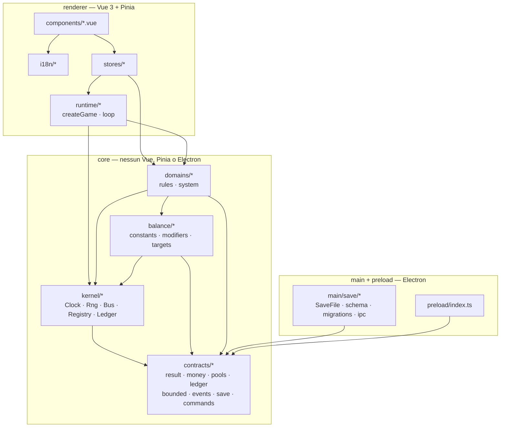

# Architettura

Documento di riferimento sullo stato **corrente** dell'architettura. Se il codice cambia i
confini, questo file cambia nello stesso task.

Mappa completa della documentazione: [README.md](README.md).
Il **perché** di ogni scelta qui sotto sta nel [compendio delle decisioni](adr/README.md); il
legame fra ogni regola e il difetto che la giustifica sta in [tracciabilita.md](tracciabilita.md).

## I livelli e le direzioni consentite

Una freccia `A --> B` significa: **A può importare B**. Non esistono frecce all'insù.



### Frecce vietate — e chi le impedisce

| Freccia vietata                                   | Perché                                             | Chi la blocca                  |
| ------------------------------------------------- | -------------------------------------------------- | ------------------------------ |
| `stores/* --> stores/*`                           | 74 archi diretti e 3 cicli nel progetto precedente | ESLint `no-restricted-imports` |
| `*.vue --> domains/*/rules`, `*.vue --> kernel/*` | la logica di dominio scappa nei componenti         | ESLint + test di backstop      |
| `core/* --> vue` / `pinia` / `electron`           | `core/` deve girare in Node                        | ESLint `no-restricted-imports` |
| `core/* --> renderer/*`, `core/* --> main/*`      | inversione di dipendenza                           | ESLint                         |
| `main/* --> kernel/*`, `main/* --> domains/*`     | il main conosce il contratto, non il motore        | ESLint                         |

Il main tocca **solo** `core/contracts/save.ts`. È un arco stretto e voluto.

## Albero delle cartelle

```
solvent/
├─ .editorconfig
├─ .gitignore                     # dist/ out/ node_modules/ *.tsbuildinfo
├─ .prettierrc.json
├─ eslint.config.js               # flat config — qui vivono le regole 1,3,4,5,6,10,11
├─ electron.vite.config.ts
├─ electron-builder.yml           # appId, productName — nessun publish finto
├─ package.json
├─ tsconfig.json                  # solution: references a node/web
├─ tsconfig.node.json             # main + preload
├─ tsconfig.web.json              # renderer + core
├─ vitest.config.ts
├─ docs/
│  ├─ architettura.md             # questo file
│  └─ adr/0001..0008-*.md
├─ src/
│  ├─ main/
│  │  ├─ index.ts
│  │  └─ save/
│  │     ├─ SaveFile.ts           # lettura/scrittura atomica su disco
│  │     ├─ schema.ts             # validazione ESEGUIBILE del SaveEnvelope
│  │     ├─ migrations.ts         # unico posto al mondo
│  │     └─ ipc.ts                # save / load / reset, tipizzati
│  ├─ preload/
│  │  └─ index.ts                 # espone solo il contratto di persistenza
│  ├─ core/                       # NESSUN import di vue / pinia / electron
│  │  ├─ kernel/
│  │  │  ├─ Clock.ts              # TICKS_PER_SECOND vive SOLO qui
│  │  │  ├─ Rng.ts                # unico posto dove Math.random e' consentito
│  │  │  ├─ Bus.ts
│  │  │  ├─ Registry.ts
│  │  │  ├─ Ledger.ts
│  │  │  └─ index.ts
│  │  ├─ balance/
│  │  │  ├─ constants.ts
│  │  │  ├─ modifiers.ts          # unico registro dei moltiplicatori
│  │  │  └─ targets.ts            # bersagli di bilanciamento come DATI
│  │  ├─ contracts/
│  │  │  ├─ result.ts             # Result<T, E>
│  │  │  ├─ money.ts              # Money = Decimal + le uniche conversioni
│  │  │  ├─ pools.ts              # Pool · PoolProps · POOLS come dati
│  │  │  ├─ ledger.ts             # Posting · Transaction · Balances · LedgerError
│  │  │  ├─ bounded.ts            # boundedList<T>(max) — regola 9
│  │  │  ├─ events.ts             # interface GameEvents — unico file
│  │  │  ├─ save.ts               # SavePayload · SaveEnvelope
│  │  │  └─ commands.ts           # CommandHandler — ritorna Result
│  │  └─ domains/
│  │     └─ income/
│  │        ├─ types.ts
│  │        ├─ rules.ts           # funzioni pure, nessun effetto
│  │        └─ system.ts          # defineSystem(...)
│  └─ renderer/
│     ├─ index.html
│     ├─ main.ts
│     ├─ App.vue
│     ├─ runtime/
│     │  ├─ createGame.ts         # registra i sistemi, monta il contesto
│     │  └─ loop.ts               # rAF + accumulatore -> tick a passo fisso
│     ├─ stores/
│     │  └─ game.ts               # unico store della fetta
│     ├─ components/
│     │  ├─ BalancePanel.vue
│     │  └─ IncomePanel.vue
│     └─ i18n/
│        ├─ index.ts
│        ├─ it.ts
│        └─ en.ts
└─ tests/
   ├─ contracts/       result · money · pools · ledger · bounded · events · save · commands
   ├─ kernel/          clock · rng · bus · registry · ledger
   ├─ domains/         income (seed fisso)
   ├─ save/            roundtrip
   ├─ balance/         targets
   ├─ i18n/            parity
   └─ rules/           lint-rules · gates · core-deps · product-identity · no-todo · tick-rate
                       eslint-disable
                       no-logic-in-vue · no-literal-in-template · registry-completeness
```

## Le 12 regole e chi le fa rispettare

Legenda: **🔒 impossibile** = il tipo o la struttura non permettono di scriverlo.
**✅ bloccato** = lint o test falliscono. **⚠️ parziale** = euristica, spiegata sotto.

| #   | Regola                                     | Come è imposta                                                                                             | Forza   |
| --- | ------------------------------------------ | ---------------------------------------------------------------------------------------------------------- | ------- |
| 1   | Nessuno store importa un altro store       | ESLint `no-restricted-imports` su `src/renderer/stores/**`                                                 | ✅      |
| 2   | Nessuna lista di sistemi scritta a mano    | Solo il Registry itera + test: sistemi registrati == file `domains/*/system.ts`                            | ✅      |
| 3   | `Math.random` solo in `Rng.ts`             | ESLint `no-restricted-properties` globale, con override per il solo `Rng.ts`                               | ✅      |
| 4   | Nessun numero magico di tempo              | Tipi branded `Ticks` / `Seconds`: un `number` nudo non è assegnabile. + `no-magic-numbers` su `domains/**` | 🔒      |
| 5   | Nessuna logica di dominio nei `.vue`       | ESLint su `**/*.vue` vieta `domains/*/rules` e `kernel/*` + test grep di backstop                          | ✅      |
| 6   | Nessun denaro fuori dal Ledger             | I saldi vivono in una Map privata nella closure: non c'è nulla da assegnare. + lint di rete                | 🔒      |
| 7   | Se un sistema ha stato, ha save/load/reset | Unione discriminata `System`: con `save` presente, `load` e `reset` sono obbligatori                       | 🔒      |
| 8   | Il main scrive la versione del salvataggio | Il tipo `SavePayload` del renderer non ha un campo `version`                                               | 🔒      |
| 9   | Ogni lista storica ha un limite dichiarato | `boundedList<T>(max)` è l'unico costruttore + il validatore rifiuta array oltre `max`                      | 🔒      |
| 10  | Un solo stile di esito                     | `CommandHandler` ritorna `Result` per tipo; fuori dai comandi serve un lint                                | ⚠️ → ✅ |
| 11  | Denaro `Decimal` end-to-end                | `Money = Decimal` è una classe + lint sulle conversioni nei domini                                         | 🔒      |
| 12  | Nessuna stringa utente hardcoded           | Test di parità i18n (✅) + test euristico sui template `.vue` (⚠️)                                         | ✅ / ⚠️ |

### Le due regole non meccanizzabili al 100%, e la proposta

**Regola 10 — `Result` ovunque.** Il tipo copre i comandi, ma non impedisce a una funzione
qualunque di ritornare `boolean`. Proposta: `no-restricted-syntax` che vieta i literal di oggetto
con chiave `success`. Non copre il `boolean` nudo, ma elimina la seconda convenzione — che è
esattamente il difetto misurato (62 contro 35).

**Regola 12 — nessuna stringa hardcoded.** La parità fra lingue è un test esatto. Il "nessun
testo letterale nei template" è un test a regex sui nodi di testo dei `.vue`: cattura il caso
normale, non le stringhe costruite dinamicamente. Meglio di niente, e onesto su cosa non vede.

## Configurazione non negoziabile

- `tsconfig`: `strict`, **`noUnusedLocals`**, **`noUnusedParameters`**. Sono i due interruttori
  che intercettano gratis il codice morto. Non si spengono mai.
- Prettier ed EditorConfig descrivono l'indentazione che il progetto usa davvero, `.vue` inclusi.
  `npm run format` gira dal primo giorno, a costo zero.
- Un solo nome per il prodotto, ovunque (ADR 0008), verificato da un test.
- `.gitignore` include `dist/`, `out/`, `node_modules/`, `*.tsbuildinfo`.
- Nessun entitlement o permesso di sistema che il gioco non usa davvero.
