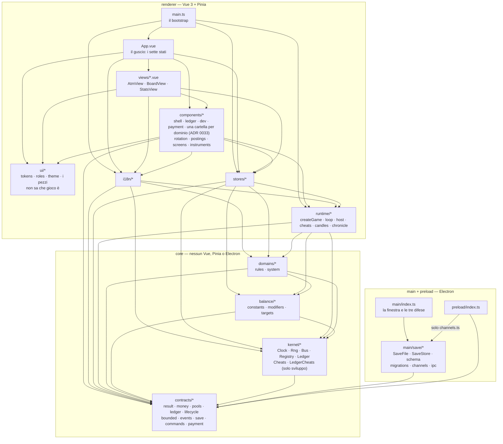

# Architettura

Documento di riferimento sullo stato **corrente** dell'architettura. Se il codice cambia i
confini, questo file cambia nello stesso task.

Mappa completa della documentazione: [README.md](README.md).
Il **perché** di ogni scelta qui sotto sta nel [compendio delle decisioni](adr/README.md); il
legame fra ogni regola e il difetto che la giustifica sta in [tracciabilita.md](tracciabilita.md).

## I livelli e le direzioni consentite

Una freccia `A --> B` significa: **A può importare B**. Non esistono frecce all'insù.



`APP --> CMP` nasce con [D024](delega/D024-il-telaio.md): il guscio monta la colonna e la testata,
che sono due componenti di gioco. Prima montava solo le viste, e le linguette se le disegnava da sé —
è esattamente ciò che quella delega ha tolto.

`CMP --> RT` nasce con [D034](delega/D034-le-serie-degli-strumenti.md), ed è di **soli tipi**: il
grafico a candele riceve dallo store delle `Candle`, e per convertirle deve nominarne la forma. La
forma sta in `runtime/` e non accanto a chi disegna perché il suo produttore è la **cronaca**, che
da [D037](delega/D037-il-tempo-che-avanza-e-un-operazione-del-gioco.md) abita lì insieme al `Game`
che la fa avanzare — prima era lo store. Un `ST --> CMP` sarebbe la freccia al contrario, cioè un
ciclo con `CMP --> ST`, che qui sopra esiste già. È lo stesso motivo per cui `sampleOf` vive in `runtime/loop.ts` invece che accanto allo store:
R01 vieta a uno store di importare ciò che gli sta accanto, e `runtime/` è dove finisce ciò che il
renderer calcola senza montare niente.

`CMP --> CON` è di soli **dati**, e non contraddice R05: un componente che mostra i pool li deriva
da `POOLS` invece di elencarli a mano, e uno che mostra i movimenti di una transazione ne nomina il
tipo. Le regole restano fuori portata — `domains/*/rules`, `kernel/*` e `balance/*` sono vietati
dal lint. La freccia esisteva già da [D012](delega/D012-ui-e-i18n.md) e non era disegnata; a
disegnarla è [D015](delega/D015-home-bancomat.md), che l'ha usata due volte.

### Frecce vietate — e chi le impedisce

| Freccia vietata                                   | Perché                                             | Chi la blocca                         |
| ------------------------------------------------- | -------------------------------------------------- | ------------------------------------- |
| `stores/* --> stores/*`                           | 74 archi diretti e 3 cicli nel progetto precedente | ESLint `no-restricted-imports`        |
| `*.vue --> domains/*/rules`, `*.vue --> kernel/*` | la logica di dominio scappa nei componenti         | ESLint + test di backstop             |
| `core/* --> vue` / `pinia` / `electron`           | `core/` deve girare in Node                        | ESLint `no-restricted-imports`        |
| `core/* --> renderer/*`, `core/* --> main/*`      | inversione di dipendenza                           | ESLint                                |
| `main/* --> kernel/*`, `main/* --> domains/*`     | il main conosce il contratto, non il motore        | ESLint                                |
| `domains/* --> domains/*`                         | il precedente che aprirebbe gli altri sedici archi | `tests/rules/domains-are-independent` |

Il main tocca **solo** `core/contracts/save.ts`. È un arco stretto e voluto.

**L'ultima riga è nuova, e fino a [D018](delega/D018-la-scheda-di-dominio.md) non c'era.** La
freccia `domains/* --> domains/*` era vietata **in prosa e da nessun altro**: il diagramma non la
distingue — due domini stanno nello stesso nodo, quindi `import-graph` la salta insieme a tutti gli
archi interni a un livello — e il lint sotto `src/core/domains/**` vieta `vue`, `pinia`, `electron`
e le conversioni di `Money`, non un dominio che ne importa un altro.

[D017](delega/D017-il-caveau.md) è la prima delega che avrebbe potuto aprirla, per due volte: il
reddito ha bisogno di sapere quanto spazio c'è nel caveau, e il bancomat di sapere se un prelievo ci
sta. In tutti e due i casi la risposta arriva **per argomento**, e a consegnarla è chi ha entrambi
sotto mano — il bootstrap per il reddito, lo store per il bancomat (ADR 0024). Due scelte identiche
nello stesso giorno sono una regola che nessuno sapeva di avere: D018 l'ha trovata compilando la
domanda 6 della [scheda di dominio](design/domini/README.md), e adesso è **R19**.

L'unica freccia dentro il riquadro `main + preload` è `preload --> main/save/channels.ts`, e porta
tre stringhe: i nomi dei canali IPC. Non passa da `ipc.ts` perché quel file importa `zod`, e un
preload in **sandbox** non carica pacchetti esterni; non è duplicata perché due costanti che devono
coincidere, e che nessuno confronta, prima o poi non coincidono più.

## Albero delle cartelle — la forma della fetta 01

Questo è l'albero **a fetta 01 finita**, non quello di oggi: serve a sapere dove va una cosa prima
di scriverla. Cosa esiste già lo dice `git ls-files`; a che punto siamo lo dice
[delega/PASSAGGIO-DI-CONSEGNE.md](delega/PASSAGGIO-DI-CONSEGNE.md).

```
solvent/
├─ .editorconfig
├─ .gitignore                     # dist/ out/ node_modules/ *.tsbuildinfo
├─ .prettierrc.json
├─ eslint.config.js               # flat config — qui vivono le regole 1,3,4,5,6,10,11
├─ electron.vite.config.ts
├─ electron-builder.yml           # appId, productName — nessun publish finto
├─ package.json
├─ tsconfig.json                  # solution: references a node/web/test
├─ tsconfig.base.json             # le opzioni comuni, strict incluso
├─ tsconfig.node.json             # main + preload
├─ tsconfig.web.json              # renderer + core
├─ tsconfig.test.json             # tests/
├─ vitest.config.ts
├─ docs/
│  ├─ architettura.md             # questo file
│  └─ adr/NNNN-*.md               # uno per decisione; l'elenco e gli stati stanno in stato.md
├─ src/
│  ├─ main/
│  │  ├─ index.ts
│  │  └─ save/
│  │     ├─ SaveFile.ts           # lettura/scrittura atomica su disco
│  │     ├─ schema.ts             # validazione ESEGUIBILE del SaveEnvelope
│  │     ├─ SaveStore.ts          # salva / carica / azzera: l'ordine dei passi
│  │     ├─ migrations.ts         # unico posto al mondo
│  │     ├─ channels.ts           # i nomi dei tre canali - condivisi col preload
│  │     └─ ipc.ts                # attacca i tre canali allo SaveStore
│  ├─ preload/
│  │  └─ index.ts                 # espone solo il contratto di persistenza
│  ├─ core/                       # NESSUN import di vue / pinia / electron
│  │  ├─ kernel/
│  │  │  ├─ Clock.ts              # TICKS_PER_SECOND vive SOLO qui
│  │  │  ├─ Rng.ts                # unico posto dove Math.random e' consentito
│  │  │  ├─ Bus.ts                # sincrono: niente code, niente storico, niente attese
│  │  │  ├─ Registry.ts
│  │  │  └─ Ledger.ts             # Capacities: la capienza si chiede, non si legge (ADR 0025)
│  │  ├─ balance/
│  │  │  ├─ constants.ts
│  │  │  ├─ modifiers.ts          # unico registro dei moltiplicatori
│  │  │  └─ targets.ts            # bersagli di bilanciamento come DATI
│  │  ├─ contracts/
│  │  │  ├─ result.ts             # Result<T, E>
│  │  │  ├─ money.ts              # Money = Decimal + le uniche conversioni
│  │  │  ├─ pools.ts              # Pool · PoolProps · POOLS come dati · capienza e portatore
│  │  │  ├─ ledger.ts             # Posting · Transaction · TransactionMeta · Balances · LedgerError
│  │  │  ├─ payment.ts            # PaymentOption · PriceList · PaymentError (ADR 0027, ADR 0042)
│  │  │  ├─ lifecycle.ts          # ResetScope — la parola che Registry e Ledger si scambiano
│  │  │  ├─ bounded.ts            # boundedList<T>(max) — regola 9
│  │  │  ├─ events.ts             # interface GameEvents — unico file
│  │  │  ├─ save.ts               # SavePayload · SaveEnvelope
│  │  │  └─ commands.ts           # CommandHandler — ritorna Result
│  │  └─ domains/
│  │     ├─ income/
│  │     │  ├─ types.ts
│  │     │  ├─ rules.ts           # funzioni pure, nessun effetto
│  │     │  ├─ commands.ts        # l'acquisto dell'upgrade, ritorna Result
│  │     │  └─ system.ts          # createIncome(ledger, modifiers, room) - ADR 0024
│  │     ├─ atm/                  # senza system.ts: non ha stato e non ticchetta (D014)
│  │     │  ├─ rules.ts           # commissione, importo valido, fitsIn
│  │     │  ├─ card.ts            # la carta come funzione del seme, e la prova (ADR 0042)
│  │     │  └─ commands.ts        # previewOf + i due comandi, ritornano Result
│  │     └─ vault/                # il caveau: ha stato, non ticchetta (D017)
│  │        ├─ types.ts
│  │        ├─ rules.ts           # capienze, listino a due voci, roomIn - pure
│  │        └─ system.ts          # createVault(ledger): il livello, e il comando expand
│  └─ renderer/
│     ├─ index.html
│     ├─ main.ts
│     ├─ App.vue                  # il guscio: i 7 stati, la navigazione, i token e le primitive
│     ├─ runtime/
│     │  ├─ createGame.ts         # registra i sistemi, monta il contesto, fa avanzare il tempo
│     │  ├─ chronicle.ts          # le serie che il tempo alimenta: una lista, due forme (R25)
│     │  ├─ host.ts               # l'unico file che tocca il browser
│     │  └─ loop.ts               # rAF + accumulatore -> tick a passo fisso
│     ├─ stores/
│     │  └─ game.ts               # unico store della fetta: stato, comandi, selettori
│     ├─ views/                   # una per destinazione: INV-22 non ne ammette una in meno
│     │  ├─ AtmView.vue           # la pagina del bancomat, due colonne (ADR 0040)
│     │  ├─ BoardView.vue         # il cruscotto: i riquadri e il grafico (ADR 0040)
│     │  ├─ IncomeView.vue        # la pagina del reddito: oggi un pulsante, e lo dice
│     │  ├─ VaultView.vue         # la pagina del caveau
│     │  └─ StatsView.vue
│     ├─ ui/                      # il kit: non sa che gioco e' (ADR 0028)
│     │  ├─ tokens.css            # i colori: l'unico posto dove un #hex e' ammesso (R15)
│     │  ├─ fonts.css
│     │  ├─ roles.ts              # ruoli di colore, misure, superfici — nessun Pool
│     │  ├─ theme.ts              # quale tema e' acceso, e l'interruttore (ADR 0031)
│     │  ├─ UiShell.vue           # il telaio: una forma, non un contenitore (ADR 0030)
│     │  ├─ UiPopover.vue         # il livello superiore: il riquadro ancorato (R22, ADR 0039)
│     │  ├─ UiDialog.vue          # il livello superiore: la finestra modale (R22, ADR 0042)
│     │  ├─ UiTooltip.vue         # l'unico modo di spiegare qualcosa (R17, ADR 0032)
│     │  └─ Ui*.vue               # superficie, etichetta, cifra, targhetta, pulsante, prosa
│     ├─ components/              # una cartella per proprietario, zero file sciolti (R18, ADR 0033)
│     │  ├─ shell/                # dell'applicazione, di nessun dominio
│     │  │  ├─ AppNav.vue         # la colonna: i gruppi, le destinazioni, l'interruttore del tema
│     │  │  ├─ AppHeader.vue      # la testata: dove sei, e la striscia degli strumenti
│     │  │  ├─ screens.ts         # destinazioni, gruppi, parole, e DOMAIN_SCREENS
│     │  │  ├─ StatTile.vue       # il riquadro del cruscotto: e' cio' che il test conta
│     │  │  ├─ series.ts          # i due estremi dell'asse del grafico - pura
│     │  │  └─ NetWorthChart.vue  # il grafico: ApexCharts montata a mano (ADR 0034)
│     │  ├─ payment/              # del pagamento: trasversale, come ledger (R24, ADR 0042)
│     │  │  ├─ PaymentDialog.vue  # l'unico posto in cui si sceglie con cosa si paga
│     │  │  └─ instruments.ts     # se uno strumento chiede una prova, e come si etichetta - pura
│     │  ├─ ledger/               # del registro
│     │  │  ├─ PostingRows.vue    # i movimenti di una transazione, riga per riga
│     │  │  ├─ postings.ts        # quali movimenti il giocatore vede - pura
│     │  │  └─ OperationList.vue  # l'estratto conto: le due viste ne mostrano quantita' diverse
│     │  ├─ atm/
│     │  │  ├─ AtmPanel.vue       # importo, importi rapidi, anteprima, conferma
│     │  │  ├─ BankCard3d.vue     # la carta: CSS 3D puro, zero logica, i dati per proprieta'
│     │  │  └─ rotation.ts        # la matematica della rotazione, pura e provata a parte
│     │  ├─ income/
│     │  │  └─ IncomePanel.vue    # l'upgrade: una CTA che apre il flusso, un comando, un rifiuto
│     │  └─ vault/
│     │     ├─ VaultPanel.vue     # la barra, lo spazio, il listino a due voci, l'ampliamento
│     │     └─ VaultAlarm.vue     # il caveau sulla pagina del bancomat: solo il muro, e solo se e' stato toccato
│     └─ i18n/
│        ├─ index.ts              # chiavi tipizzate, Translator, GameError
│        ├─ it.ts
│        └─ en.ts
└─ tests/
   ├─ helpers/         sources (lettura dei sorgenti per i test di regola) - host (il finto browser)
   ├─ contracts/       result · money · pools · ledger · bounded · events · save · commands · payment
   ├─ kernel/          clock · rng · bus · registry · ledger · ledger-capacity
   ├─ domains/         income/ rules - commands - system · atm/ rules - commands
                       vault/ rules - system
   ├─ save/            schema - roundtrip - kernel-roundtrip - migrations - ipc - preload
   ├─ balance/         modifiers · targets
   ├─ i18n/            parity · translator
   ├─ renderer/        createGame · loop · store · postings · rotation · theme · series
   └─ rules/           lint-rules · gates · core-deps · product-identity · no-todo · tick-rate
                       eslint-disable · bus-synchronous · main-save-only · board-tiles
                       no-logic-in-vue · no-literal-in-template · english-identifiers
                       doc-links · docs-facts · markdown-form · project-state
                       domains-no-internal-pools · domains-no-money-literals
                       registry-completeness · registry-no-special-cases
                       no-barrel · forbidden-words · pure-rules · import-graph
                       stateful-systems-reject-garbage · ui-kit-is-standalone
                       no-color-literals · ui-kit-has-no-geometry · no-native-tooltips
                       domain-ui · domains-are-independent
```

## Le regole e chi le fa rispettare

Legenda: **🔒 impossibile** = il tipo o la struttura non permettono di scriverlo.
**✅ bloccato** = lint o test falliscono. **⚠️ parziale** = euristica, spiegata sotto.

| #   | Regola                                         | Come è imposta                                                                                                                                                                                                                        | Forza   |
| --- | ---------------------------------------------- | ------------------------------------------------------------------------------------------------------------------------------------------------------------------------------------------------------------------------------------- | ------- |
| 1   | Nessuno store importa un altro store           | ESLint `no-restricted-imports` su `src/renderer/stores/**`                                                                                                                                                                            | ✅      |
| 2   | Nessuna lista di sistemi scritta a mano        | Solo il Registry itera + test: sistemi registrati == file `domains/*/system.ts`                                                                                                                                                       | ✅      |
| 3   | `Math.random` solo in `Rng.ts`                 | ESLint `no-restricted-properties` globale, **senza eccezioni di file**: l'unica riga esente si motiva                                                                                                                                 | ✅      |
| 4   | Nessun numero magico di tempo                  | Tipi branded `Ticks` / `Seconds`: un `number` nudo non è assegnabile. + `no-magic-numbers` su `domains/**`                                                                                                                            | 🔒      |
| 5   | Nessuna logica di dominio nei `.vue`           | ESLint su `**/*.vue` vieta `domains/*/rules` e `kernel/*` + test grep di backstop                                                                                                                                                     | ✅      |
| 6   | Nessun denaro fuori dal Ledger                 | I saldi vivono in una Map privata nella closure: non c'è nulla da assegnare. + lint di rete                                                                                                                                           | 🔒      |
| 7   | Se un sistema ha stato, ha save/load/reset     | Unione discriminata `System`: con `save` presente, `load` e `reset` sono obbligatori. Il tipo garantisce che un `load` **esista**, non quale stato accetti: quello è INV-20, e lo prova `tests/rules/stateful-systems-reject-garbage` | 🔒 / ✅ |
| 8   | Il main scrive la versione del salvataggio     | Il tipo `SavePayload` del renderer non ha un campo `version`                                                                                                                                                                          | 🔒      |
| 9   | Ogni lista storica ha un limite dichiarato     | `boundedList<T>(max)` è l'unico costruttore + il validatore rifiuta array oltre `max`                                                                                                                                                 | 🔒      |
| 10  | Un solo stile di esito                         | `CommandHandler` ritorna `Result` per tipo + lint contro i literal con chiave `success`                                                                                                                                               | ⚠️      |
| 11  | Denaro `Decimal` end-to-end                    | `Money = Decimal` è una classe + lint sulle conversioni nei domini                                                                                                                                                                    | 🔒      |
| 12  | Nessuna stringa utente hardcoded               | Test di parità i18n (✅) + test euristico sui template `.vue` (⚠️)                                                                                                                                                                    | ✅ / ⚠️ |
| 13  | Un file `rules.ts` è puro                      | `tests/rules/pure-rules`: nessun `ctx`, nessun effetto, nessuna lettura dell'ora                                                                                                                                                      | ⚠️      |
| 14  | Il kit UI non sa che gioco è                   | ESLint `no-restricted-imports` su `src/renderer/ui/**` + `tests/rules/ui-kit-is-standalone`, che risolve anche i percorsi relativi                                                                                                    | ✅      |
| 15  | Nessun colore fuori dai token                  | `tests/rules/no-color-literals`: un'eccezione sola, `ui/tokens.css`, e non è configurabile                                                                                                                                            | ✅      |
| 16  | Il kit non prende la geometria                 | `tests/rules/ui-kit-has-no-geometry`: nessun `defineProps` di `ui/**` dichiara `gap`, `direction`, `width`… È il criterio dell'ADR 0030, reso verificabile                                                                            | ⚠️      |
| 17  | Nessun tooltip nativo                          | `tests/rules/no-native-tooltips`: nessun attributo `title` in un `.vue` di `src/`. Distingue l'attributo di un elemento dalla proprietà di un componente, che si chiama `title` a ragione                                             | ⚠️      |
| 18  | Un dominio ha la sua cartella in `components/` | `tests/rules/domain-ui`: nessun file sciolto nella radice, ogni sottocartella è un dominio o una delle due dichiarate, e ogni dominio dice dove si guarda — anche quando la risposta è `null` (ADR 0033)                              | ✅      |
| 19  | Nessun dominio importa un altro dominio        | `tests/rules/domains-are-independent`: risolve l'alias **e** i percorsi relativi, e non fa sconti all'`import type` — un tipo non aggiunge codice, aggiunge un nome che lega due domini                                               | ✅      |
| 20  | I cheat esistono solo in sviluppo              | `tests/rules/cheats-are-dev-only`: nessun import di valore fuori dal ramo che il compilatore spegne, e l'elenco dei `CheatId` è chiuso                                                                                                |
| 21  | Nessun `z-index` in `src/`                     | `tests/rules/no-z-index`: `.ts`, `.vue` e `.css`. Chi deve stare sopra passa dal livello superiore, che non partecipa all'impilamento                                                                                                 |
| 22  | Il livello superiore passa dal kit             | `tests/rules/overlays-pass-through-the-kit`: `popover` vive in `UiPopover` e `<dialog>` in `UiDialog`, e in nessun altro `.vue`                                                                                                       |
| 23  | Il vestito dei grafici vive in un file solo    | `tests/rules/chart-dress`: nessuna classe di ApexCharts nominata fuori da `ChartPanel.vue`                                                                                                                                            |
| 24  | La scelta di con cosa si paga è un pezzo solo  | `tests/rules/payment-flow`: fuori da `components/payment/` nessun `.vue` nomina un'opzione di pagamento né cicla su un listino                                                                                                        |
| 25  | Il tempo di gioco avanza in un posto solo      | `tests/rules/one-way-to-advance`: fuori da `runtime/createGame.ts` nessun file del renderer nomina `tickAll`. `Game.advance` ticchetta i sistemi **e** alimenta la cronaca, così nessun chiamante può fare metà del lavoro (ADR 0043) |

**Quando entra ciascun meccanismo.** Alcune di queste regole sono già in vigore, altre nascono con
la delega che le usa: la colonna _Delega_ di [tracciabilita.md](tracciabilita.md) dice quale, per
ognuna. Qui c'è la forma finale del meccanismo, non la data.

Il diagramma qui sopra non è un disegno: `tests/rules/import-graph` ricostruisce il grafo di
import da `src/` e lo confronta con le sue frecce **nei due versi** — un arco reale non disegnato è
rosso, un arco disegnato che non esiste è rosso, e un file che non appartiene a nessun nodo è rosso
(regola C13, [D022](delega/D022-il-confine-disegnato-e-il-confine-vero.md)). Modella i **passaggi
di livello**: un modulo che importa un fratello dello stesso livello è coesione interna, e non si
disegna.

### Le tre regole non meccanizzabili al 100%

**Regola 10 — `Result` ovunque.** Il tipo copre i comandi, ma non impedisce a una funzione
qualunque di ritornare `boolean`. Il lint `no-restricted-syntax` vieta i literal di oggetto con
chiave `success` (in vigore da D001, verificato in `tests/rules/lint-rules`). Non copre il
`boolean` nudo, ma elimina la seconda convenzione — che è esattamente il difetto misurato
(62 contro 35). Resta ⚠️ per quello che non copre, ed è dichiarato in
[tracciabilita.md](tracciabilita.md#cosa-questa-tabella-non-copre).

**Regola 12 — nessuna stringa hardcoded.** La parità fra lingue è un test esatto. Il "nessun
testo letterale nei template" è un test a regex sui nodi di testo dei `.vue`: cattura il caso
normale, non le stringhe costruite dinamicamente. Meglio di niente, e onesto su cosa non vede.

**Regola 13 — un `rules.ts` è puro.** Il test cerca le forme in cui l'impurità entra — un `ctx` fra
i parametri, `Date.now`, un `emit`, un import di valore dal kernel — e non dimostra la purezza, che
richiederebbe l'analisi del flusso. Una funzione che muta un array ricevuto per argomento gli
sfugge. Fino a D022 questa regola non aveva nemmeno un ID.

## Configurazione non negoziabile

- `tsconfig`: `strict`, **`noUnusedLocals`**, **`noUnusedParameters`**. Sono i due interruttori
  che intercettano gratis il codice morto. Non si spengono mai.
- Prettier ed EditorConfig descrivono l'indentazione che il progetto usa davvero, `.vue` inclusi.
  `npm run format` gira dal primo giorno, a costo zero.
- Un solo nome per il prodotto, ovunque (ADR 0008), verificato da un test.
- `.gitignore` include `dist/`, `out/`, `node_modules/`, `*.tsbuildinfo`.
- Nessun entitlement o permesso di sistema che il gioco non usa davvero.
