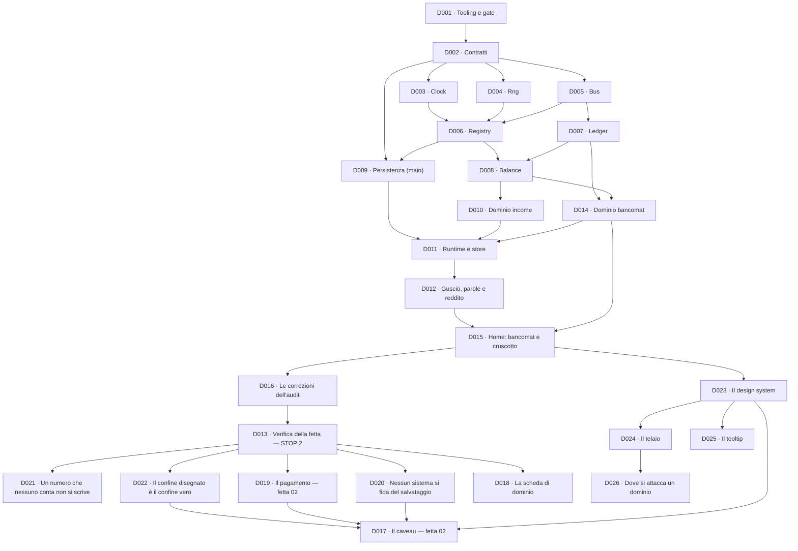

# Documenti di delega

> Se stai arrivando ora sul progetto, parti da
> **[PASSAGGIO-DI-CONSEGNE.md](PASSAGGIO-DI-CONSEGNE.md)**: stato, regole e prossimo passo.

Una **delega** è un pacchetto di lavoro autosufficiente: chi la prende in mano deve poterla
eseguire senza fare domande e senza aver letto la conversazione in cui è nata.

Vale per una persona, per un agente, o per me stesso fra tre mesi — che è lo stesso caso.

## Cosa contiene una delega

| Sezione                  | A cosa serve                                                                         |
| ------------------------ | ------------------------------------------------------------------------------------ |
| **Intestazione**         | stato, dipendenze, cosa sblocca, ADR vincolanti, regole applicabili, budget di righe |
| **Obiettivo**            | una frase. Se ne servono due, la delega è due deleghe                                |
| **Da produrre**          | i file esatti, con il loro contenuto atteso                                          |
| **Invarianti**           | ciò che deve essere vero quando la delega è chiusa, e restare vero dopo              |
| **Fuori scope**          | ciò che è tentante fare qui e va fatto altrove, o mai                                |
| **Definizione di fatto** | la lista di spunte. Tutte, non alcune                                                |
| **Trappole note**        | cosa è andato storto nel progetto precedente in questo punto preciso                 |

La sezione **Fuori scope** è quella che fa il lavoro: senza, ogni delega assorbe le vicine e si
torna a costruire venti cose insieme (ADR 0014).

## Il budget di righe

Ogni delega dichiara un ordine di grandezza. Non è un limite contrattuale: è un **allarme**.

Se la delega del Registry dichiara ~140 righe e ne stai scrivendo 400, non hai sforato un budget:
stai risolvendo un problema diverso da quello descritto. Fermati e dillo, invece di continuare.

Il kernel intero — D003 fino a D008 — dichiarava ~500 righe e ne misura **545** (il dettaglio, e
come ci è arrivato, è [nell'indice](#indice)). È una specifica, non una speranza: il 9% di
sforamento ha un nome per ogni riga, ed è per questo che si può dire com'è successo invece di
scoprirlo alla fine.

## Ciclo di vita

    Aperta  →  In corso  →  Chiusa

- **Aperta**: scritta, dipendenze non ancora soddisfatte, oppure nessuno ci sta lavorando.
- **In corso**: esiste un ramo `dNNN-slug`.
- **Chiusa**: la definizione di fatto è tutta verde. Si annota il commit e non si tocca più.

Fra _Aperta_ e _In corso_ c'è un passaggio che non è uno stato ma si vede nel git log: una delega
può essere **preparata per l'esecuzione**, cioè riletta con il codice che nel frattempo esiste e
corretta dove è invecchiata. È successo a [D009](D009-persistenza-main.md),
[D014](D014-dominio-bancomat.md) e [D013](D013-verifica-della-fetta.md), e ogni volta ha tolto
lavoro invece di aggiungerlo: quasi tutto ciò che quelle deleghe chiedevano di costruire esisteva
già.

Da [D017](D017-il-caveau.md) la preparazione ha smesso di essere una rilettura ed è diventata una
**misura**: si fa davvero il cambiamento, si guarda cosa diventa rosso, e poi si torna indietro
lasciando solo le misure nel testo della delega.

**E si rifà, se nel frattempo il codice si è mosso.** D017 è stata scritta allo STOP 2 e da allora
si sono chiuse D019, D020 e D023: la sua preparazione è stata ripetuta il 2026-08-21 sulla stessa
riga di `POOLS.cash`, e il difetto del recupero è risultato **identico** — stesso messaggio, stesso
numero. Quello che era invecchiato non era la misura: era la prosa attorno, e in particolare una
sezione intera che dichiarava provvisoria una direzione visiva ormai chiusa. Una misura ripetuta
costa dieci minuti; una sezione sbagliata letta da chi esegue costa una mattina. D017 ci ha trovato un difetto nella propria
decisione di gioco; [D020](D020-nessun-sistema-si-fida-del-salvataggio.md) ci ha trovato una
trappola che, come era scritta, non si riproduceva. Il costo è mezz'ora e il ritorno è che nessuna
delle due parte da un testo che si scoprirà sbagliato a metà lavoro.

Una delega chiusa è un **documento storico**, non una fonte di verità sul codice corrente. Le
firme che contiene descrivono ciò che è stato chiesto, non ciò che c'è: per quello si legge il
codice. È la ragione per cui i documenti vivi ([architettura](../architettura.md),
[tracciabilità](../tracciabilita.md), [glossario](../glossario.md)) non duplicano mai le firme.

## L'ordine, e perché è questo

**D017 e D018 non si toccano**, ed è il primo caso del progetto: una scrive codice, l'altra solo
documenti, e nessuna aspetta l'altra. Il grafo lo mostra facendole partire entrambe da D013, e la
freccia resta assente anche adesso che D017 è chiusa: una delega che viene **prima** non è una
delega da cui si **dipende**, e disegnarla sarebbe scrivere nel grafo una cronologia invece di un
vincolo.

**L'ordine in cui sono state eseguite però non era indifferente, ed è andata bene.** D017 per prima
significa che il caveau **esiste**, quindi tutte e tre le schede di prova di D018 si compilano
leggendo `src/` invece che una dal codice, una dal codice e una da un disegno. E significa che la
trappola più costosa di D018 è già scattata da sola: la [scheda del caveau](../design/domini/vault.md)
era stata scritta prima del suo codice, si è riletta contro quel codice il giorno dopo, e ha
smentito **tre** delle proprie righe senza cambiare nessuna delle proprie decisioni di gioco. È la
misura che D018 si era prenotata, arrivata prima che D018 cominciasse.

Se l'ordine fosse stato l'opposto, D018 avrebbe consegnato ai quattordici domini futuri una forma
provata su due domini scritti e uno immaginato — e non avrebbe avuto modo di sapere quale delle sue
domande prende la classe di errore che il caveau ha davvero commesso.

**D019 si è infilata fra D013 e D017**, ed è nata da una domanda posta al momento giusto: prima di
eseguire D017 si è ragionato su come si sceglie con cosa si paga. È venuto fuori che
l'[ADR 0017](../adr/0017-il-denaro-e-plurale.md) aveva promesso quel meccanismo dalla fetta 01 e
nessuno l'aveva costruito, e che il caveau sarebbe stato il **secondo** comando a spendere — cioè
l'ultimo momento per rispondere senza rifare niente. Se D017 fosse partita il giorno prima, avrebbe
scelto un pool nel sorgente e D019 avrebbe dovuto disfarlo.

**Ed è la prima chiusa della fetta 02.** È costata meno del previsto — 87 righe di sorgente contro
~140 — e la ragione è quella che la delega dichiarava: metà del sistema esisteva già nel kernel, e
non si è toccata. Il caveau adesso trova il listino invece di doverselo inventare, e in
[D017](D017-il-caveau.md) c'è scritto cosa esattamente.

**D020 usa lo stesso argomento di D001, ed è la seconda volta che il progetto lo accetta.** Il
caveau è il **secondo** dominio con stato, e fino a D020 niente obbligava un dominio a controllare
il salvataggio che riceve. Se la regola nascesse dentro D017, la scriverebbe la stessa persona che
scrive il codice da sorvegliare, nello stesso momento: non sorveglierebbe niente. Zero righe di
sorgente, settanta di test.

**Ed è chiusa, esattamente sul budget**: 70 righe di test, zero di sorgente. La preparazione aveva
scritto il test per davvero prima di ritirarlo, e ne aveva riscritto la trappola principale perché
come era formulata non si riproduceva — i dodici punti stanno in fondo a quella delega. Eseguirla
ha aggiunto una cosa che nemmeno la preparazione aveva visto: un `load` che rifiuta **tutto** passa
i punti 2 e 3, e a fermarlo è solo la controprova.

**D017 è chiusa, e con lei la fetta 02.** Le tre deleghe che si erano infilate davanti — D019, D020
e D023 — hanno pagato: il listino c'era, la regola sul salvataggio c'era, il kit c'era, e nessuna
delle tre è stata riaperta eseguendo il caveau. Quello che invece la delega **non** ha raccolto è il
raggruppamento dello stipendio nelle ultime operazioni: il suo grilletto era «la fetta 02», la fetta
è conclusa, e quel lavoro non stava né nella tabella _Da produrre_ di D017 né nella sua definizione
di fatto. La voce resta nel [registro YAGNI](../roadmap-fette.md) con un grilletto nuovo, ed è
scritto perché — vedi la correzione 12 di [D017](D017-il-caveau.md).

**D023 si infila fra D020 e D017, ed è la terza volta che una domanda posta al momento giusto
sposta il grafo.** L'utente ha consegnato un design vero, fatto a foglio bianco da Claude Design, e
la domanda è nata da sé: il caveau è la **prima schermata nuova** dopo la fetta 01, e una schermata
disegnata prima che esista il sistema è una schermata da rifare. Vale la stessa cosa detta per D019
— l'ultimo momento per rispondere senza disfare niente — con una differenza: qui non si scopre un
buco, si riceve un materiale.

**Ed è chiusa lo stesso giorno**, dentro il budget: 346 righe di kit e 129 di test, con la
migrazione che ne toglie 62 dai file che c'erano già. Eseguirla ha trovato una cosa che nessuna
lettura poteva trovare — `UiButton` **scriveva** `disabled` pur non avendo quella proprietà, e
avrebbe rovesciato in silenzio una decisione presa da D019.

Il canvas non è un kit: è un prototipo di **tutta** l'applicazione, diciotto domini, senza nemmeno
una classe CSS. D023 ne prende le fondamenta e mette il resto nel
[registro YAGNI](../roadmap-fette.md) con i grilletti, perché costruirlo tutto adesso sarebbe A17
con un vestito bello. E sostituisce [P2](../prodotto/preferenze.md), che era una preferenza
approvata: il fondo, l'accento e i caratteri cambiano, e le tre differenze stanno scritte lì invece
che scoperte leggendo il CSS.

**D021 e D022 lo usano per la terza e la quarta volta.** D021 lo applica ai documenti, D022 ai
confini del codice che oggi tiene la review — le frecce di [architettura.md](../architettura.md),
la purezza dei `rules.ts`, dove nasce un numero che il giocatore vede. Sono gemelle e non si
toccano: una legge documenti, l'altra sorgenti.

**Su D021, in dettaglio.** Nasce dall'audit dello
STOP 2, che ha trovato dodici difetti — nessuno nel sorgente, sette della stessa forma: un numero
vero quando è stato scritto e mai più riguardato. La correzione di
[D016](D016-correzioni-audit.md) era stata un aggiornamento, e un aggiornamento protegge il giorno
in cui lo si esegue e nessun altro: sei mesi dopo sarebbe successo di nuovo, e invece è successo
poche ore dopo. Viene prima delle altre perché la fetta 02 scrive documenti nuovi, e ognuno
scritto prima del meccanismo è un documento in più da rileggere a mano.

**D001 è prima di tutto, e non è un caso.** Le regole devono esistere prima del codice che
governano. Se il lint arriva dopo, il primo codice nasce fuori regola e la prima cosa che si fa è
un'eccezione — che poi diventa la norma. È letteralmente il difetto A16: un formattatore
configurato dopo che c'erano già 156 file.

## Indice

| ID                                                        | Titolo                                                                | Budget                    | Stato      |
| --------------------------------------------------------- | --------------------------------------------------------------------- | ------------------------- | ---------- |
| [D001](D001-tooling-e-gate.md)                            | Tooling, regole e gate di qualità                                     | 191 config + 265 test     | **Chiusa** |
| [D002](D002-contratti.md)                                 | Contratti: `Result`, `Money`, `bounded`, eventi, salvataggio, comandi | 113 codice + 417 test     | **Chiusa** |
| [D003](D003-kernel-clock.md)                              | Kernel: Clock                                                         | 20 codice + 116 test      | **Chiusa** |
| [D004](D004-kernel-rng.md)                                | Kernel: Rng                                                           | 55 codice + 172 test      | **Chiusa** |
| [D005](D005-kernel-bus.md)                                | Kernel: Bus                                                           | 67 codice + 303 test      | **Chiusa** |
| [D006](D006-kernel-registry.md)                           | Kernel: Registry                                                      | 124 codice + 406 test     | **Chiusa** |
| [D007](D007-kernel-ledger.md)                             | Kernel: Ledger — pool, transazioni atomiche, partita doppia           | 197 codice + 420 test     | **Chiusa** |
| [D008](D008-balance.md)                                   | Balance: costanti, modificatori, bersagli                             | 70 codice + 154 test      | **Chiusa** |
| [D009](D009-persistenza-main.md)                          | Persistenza nel processo main                                         | 259 codice + 591 test     | **Chiusa** |
| [D010](D010-dominio-income.md)                            | Dominio: income                                                       | 102 codice + 302 test     | **Chiusa** |
| [D014](D014-dominio-bancomat.md)                          | Dominio: bancomat — deposita, preleva, commissione                    | 65 codice + 548 test      | **Chiusa** |
| [D011](D011-runtime-e-store.md)                           | Runtime e store                                                       | 379 codice + 774 test     | **Chiusa** |
| [D012](D012-ui-e-i18n.md)                                 | Il guscio, le parole e il reddito                                     | 1.060 codice + 740 test   | **Chiusa** |
| [D015](D015-home-bancomat.md)                             | La home: bancomat, carta e cruscotto                                  | 725 codice + 321 test     | **Chiusa** |
| [D016](D016-correzioni-audit.md)                          | Le correzioni dell'audit del 2026-08-20                               | 186 codice + 326 test     | **Chiusa** |
| [D013](D013-verifica-della-fetta.md)                      | Verifica della fetta — STOP 2                                         | 93 test + 17 di README    | **Chiusa** |
| [D021](D021-un-numero-che-nessuno-conta-non-si-scrive.md) | Un numero che nessuno conta non si scrive                             | 672 test + 56 generate    | **Chiusa** |
| [D022](D022-il-confine-disegnato-e-il-confine-vero.md)    | Il confine disegnato è il confine vero                                | 264 test + 5 di sorgente  | **Chiusa** |
| [D019](D019-il-pagamento.md)                              | Il pagamento: il listino di un'azione, e chi lo sceglie               | 87 codice + 204 test      | **Chiusa** |
| [D020](D020-nessun-sistema-si-fida-del-salvataggio.md)    | Nessun sistema si fida del proprio salvataggio                        | 70 test, zero di sorgente | **Chiusa** |
| [D023](D023-il-design-system.md)                          | Il design system: un livello che non sa che gioco è                   | 346 codice + 129 test     | **Chiusa** |
| [D017](D017-il-caveau.md)                                 | Il caveau: i contanti hanno una capienza — fetta 02                   | 347 codice + 508 test     | **Chiusa** |
| [D018](D018-la-scheda-di-dominio.md)                      | La scheda di dominio: la forma, e le prime tre compilate              | ~510 di documentazione    | **Aperta** |
| [D024](D024-il-telaio.md)                                 | Il telaio: dove ogni schermata si attacca                             | 359 codice + 96 test      | **Chiusa** |
| [D025](D025-il-tooltip.md)                                | Il tooltip: la spiegazione che non occupa posto                       | 164 codice + 48 test      | **Chiusa** |
| [D026](D026-dove-si-attacca-un-dominio.md)                | Dove si attacca un dominio: la pagina, e le cartelle che la reggono   | 124 codice + 81 test      | **Chiusa** |

D014, D015 e D016 hanno i numeri più alti perché sono nate dopo: D014 con gli ADR 0017–0020, D015
il 2026-08-19 spezzando D012, D016 il 2026-08-20 dall'audit della codebase. Nel grafo sopra si vede
dove stanno davvero — D014 accanto a D010, D015 fra D012 e D013, D016 **prima** di D013. D017 è la
prima della **fetta 02** e la prima con il numero al posto giusto: nasce dopo D016 e viene dopo.
**La numerazione è cronologica, l'ordine è il grafo**: rinumerare romperebbe i riferimenti nei
commit e nella tracciabilità.

**D018 è la prima delega che non appartiene a nessuna fetta.** Nasce il 2026-08-20 dalla
riscrittura della [visione](../prodotto/visione.md) e dall'audit del kernel che ne è seguito, e non
costruisce gioco: costruisce la **scheda** che ogni dominio futuro dovrà compilare prima di essere
scritto, con dentro le dodici domande sul kernel che l'audit ha dovuto fare a mano. È anche la prima
con un budget di sole righe di documentazione, e la prima in cui **zero righe di codice** è una
condizione di correttezza invece di una stima.

**D024 finisce ciò che D023 aveva cominciato**, e la divisione fra le due è quella che l'ADR 0014
chiede: D023 ha preso dal canvas le fondamenta — i ruoli di colore, le scale, i caratteri, sei pezzi
— e ha lasciato l'impaginazione dov'era. D024 prende il telaio, e prende **solo** le caselle che un
selettore dello store può riempire oggi: il canvas ne disegna una dozzina e le altre non hanno un
numero dietro. È la stessa disciplina di D023 applicata al giro dopo, ed è la ragione per cui questa
delega si misura in ciò che **non** costruisce.

**D025 è la prima delega che nasce da un grilletto invece che da una fetta.** Il registro YAGNI
teneva «il sistema di sovrapposizioni» con una condizione scritta — _la prima cosa che deve stare
sopra il resto_ — e il tooltip è quella cosa. Non è stata anticipata e non è stata aggirata: la
condizione si è avverata, e la voce esce dal registro entrando in una delega. È il primo giro
completo di quel meccanismo, ed è la prova che il registro non era un posto dove le idee vanno a
morire.

**[D026](D026-dove-si-attacca-un-dominio.md) è la prima delega che nasce da una domanda invece che
da una fetta o da un grilletto**, e la domanda è dell'utente: _dove vive l'interfaccia di un
dominio?_ È nata guardando il caveau — un dominio intero finito dentro il pannello dei contanti, non
per decisione ma perché quel pannello c'era già. È anche la prima che arriva **non preparata per
l'esecuzione**, e lo dichiara: porta tre decisioni che non spettano a chi l'ha scritta, e chi la
esegue le porta all'utente prima di toccare un file. Una delega che decide al posto dell'utente cosa
diventa la home sarebbe una delega che si scopre sbagliata a metà lavoro.

**Ed è chiusa lo stesso giorno in cui è stata scritta**, con le tre decisioni prese: la home resta
il bancomat (scelta dall'utente, l'ADR 0018 confermato invece che superato), ogni dominio ha la sua
pagina salvo dichiarare `null`, e `components/` si divide in cinque cartelle per proprietario. Il
consuntivo è **sotto il budget più basso pur avendo scelto la strada più cara**, perché due terzi
del lavoro sono `git mv` e un file spostato non produce righe. Le decisioni 2 e 3 sono state prese
in autonomia su direttiva generale dell'utente, quindi sono contestabili: stanno nell'
[ADR 0033](../adr/0033-un-dominio-ha-una-cartella-e-una-pagina.md), che è il posto dove una
decisione si contesta.

**D024 e D025 sono state eseguite insieme e chiuse in un commit solo**, ed è la prima volta: le due
spunte che restavano — l'interruttore premuto, il tooltip toccato col tabulatore — si pagano nella
**stessa** sessione a occhio, e separarle avrebbe voluto dire aprire due volte la stessa finestra.
Le righe della tabella qui sopra sono quindi una divisione, non due misure indipendenti: ogni file
sta con la delega di cui porta la funzione, e i sette file che si toccano tutte e due — le tre
schermate, il riquadro e i tre dell'i18n — sono divisi riga per riga. Il totale è 523 di sorgente e
144 di test, e le quattro cifre della tabella lo sommano.

**Perché D016 sta prima dello STOP 2.** D013 riporta che la fetta regge; l'audit ha trovato un
difetto di perdita dati. Riportare un verdetto con quel difetto aperto sarebbe riportare un
verdetto falso, e il passo 5 del percorso manuale di D013 — «chiudo la finestra» — ci passa
esattamente sopra senza vederlo, perché lì il salvataggio è valido. Infilare le correzioni dentro
D013 era l'alternativa, ed è stata scartata: una delega che verifica e insieme corregge non può
più dire quale delle due cose ha fatto.

**Perché D012 è stata spezzata.** Valeva ~1.150 righe, più del kernel intero, e il numero era una
misura fatta sui mockup — non una stima. Una delega di quella dimensione non è verificabile a metà
strada: la definizione di fatto arriva tutta insieme alla fine. Il taglio passa fra i due mockup,
che non sono due schermate ma due momenti — gli **stati** e il reddito da una parte, la **home**
col bancomat dall'altra.

Il kernel — D003, D004, D005, D006, D007, D008 — è **finito**, e a D008 stava in **535 righe**:
Clock 20, Rng 55, Bus 67, Registry 126, Ledger 197, Balance 70. Rimisurato a
[D013](D013-verifica-della-fetta.md) fa **545**, e le dieci righe in più sono due: sei al Clock, che
a D011 ha preso `ticksToMilliseconds` e il tipo `Milliseconds` per il loop, e quattro a `balance/`,
con `ATM_FEE` e i quattro importi rapidi. Il budget iniziale era ~500, poi ~560 quando
gli ADR 0017/0019/0020 hanno fatto crescere il Ledger, poi ~530 perché le prime quattro deleghe
erano uscite sotto la stima, poi ~555 quando il Ledger ha ripreso quei 25 e qualcosa in più. Il
Balance è rientrato di venti. Nessuna delle cinque cifre è stata subita: ognuna è dichiarata dov'è
cambiata, e l'ultima è una misura, non una stima.
