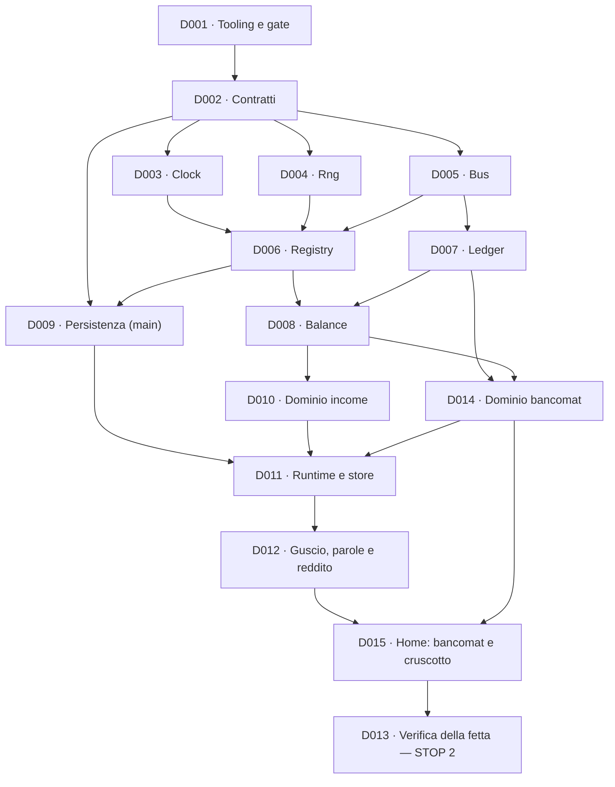

# Documenti di delega

> Se stai arrivando ora sul progetto, parti da
> **[PASSAGGIO-DI-CONSEGNE.md](PASSAGGIO-DI-CONSEGNE.md)**: stato, regole e prossimo passo.

Una **delega** è un pacchetto di lavoro autosufficiente: chi la prende in mano deve poterla
eseguire senza fare domande e senza aver letto la conversazione in cui è nata.

Vale per una persona, per un agente, o per me stesso fra tre mesi — che è lo stesso caso.

## Cosa contiene una delega

| Sezione                  | A cosa serve                                                                         |
| ------------------------ | ------------------------------------------------------------------------------------ |
| **Intestazione**         | stato, dipendenze, cosa sblocca, ADR vincolanti, regole applicabili, budget di righe |
| **Obiettivo**            | una frase. Se ne servono due, la delega è due deleghe                                |
| **Da produrre**          | i file esatti, con il loro contenuto atteso                                          |
| **Invarianti**           | ciò che deve essere vero quando la delega è chiusa, e restare vero dopo              |
| **Fuori scope**          | ciò che è tentante fare qui e va fatto altrove, o mai                                |
| **Definizione di fatto** | la lista di spunte. Tutte, non alcune                                                |
| **Trappole note**        | cosa è andato storto nel progetto precedente in questo punto preciso                 |

La sezione **Fuori scope** è quella che fa il lavoro: senza, ogni delega assorbe le vicine e si
torna a costruire venti cose insieme (ADR 0014).

## Il budget di righe

Ogni delega dichiara un ordine di grandezza. Non è un limite contrattuale: è un **allarme**.

Se la delega del Registry dichiara ~140 righe e ne stai scrivendo 400, non hai sforato un budget:
stai risolvendo un problema diverso da quello descritto. Fermati e dillo, invece di continuare.

Il kernel intero — D003 fino a D008 — sta in 535 righe (il dettaglio, e come ci è arrivato, è
[nell'indice](#indice)). È una specifica, non una speranza.

## Ciclo di vita

    Aperta  →  In corso  →  Chiusa

- **Aperta**: scritta, dipendenze non ancora soddisfatte, oppure nessuno ci sta lavorando.
- **In corso**: esiste un ramo `dNNN-slug`.
- **Chiusa**: la definizione di fatto è tutta verde. Si annota il commit e non si tocca più.

Una delega chiusa è un **documento storico**, non una fonte di verità sul codice corrente. Le
firme che contiene descrivono ciò che è stato chiesto, non ciò che c'è: per quello si legge il
codice. È la ragione per cui i documenti vivi ([architettura](../architettura.md),
[tracciabilità](../tracciabilita.md), [glossario](../glossario.md)) non duplicano mai le firme.

## L'ordine, e perché è questo

**D001 è prima di tutto, e non è un caso.** Le regole devono esistere prima del codice che
governano. Se il lint arriva dopo, il primo codice nasce fuori regola e la prima cosa che si fa è
un'eccezione — che poi diventa la norma. È letteralmente il difetto A16: un formattatore
configurato dopo che c'erano già 156 file.

## Indice

| ID                                   | Titolo                                                                | Budget                | Stato      |
| ------------------------------------ | --------------------------------------------------------------------- | --------------------- | ---------- |
| [D001](D001-tooling-e-gate.md)       | Tooling, regole e gate di qualità                                     | 191 config + 265 test | **Chiusa** |
| [D002](D002-contratti.md)            | Contratti: `Result`, `Money`, `bounded`, eventi, salvataggio, comandi | 113 codice + 417 test | **Chiusa** |
| [D003](D003-kernel-clock.md)         | Kernel: Clock                                                         | 20 codice + 116 test  | **Chiusa** |
| [D004](D004-kernel-rng.md)           | Kernel: Rng                                                           | 55 codice + 172 test  | **Chiusa** |
| [D005](D005-kernel-bus.md)           | Kernel: Bus                                                           | 67 codice + 303 test  | **Chiusa** |
| [D006](D006-kernel-registry.md)      | Kernel: Registry                                                      | 124 codice + 406 test | **Chiusa** |
| [D007](D007-kernel-ledger.md)        | Kernel: Ledger — pool, transazioni atomiche, partita doppia           | 197 codice + 420 test | **Chiusa** |
| [D008](D008-balance.md)              | Balance: costanti, modificatori, bersagli                             | 70 codice + 154 test  | **Chiusa** |
| [D009](D009-persistenza-main.md)     | Persistenza nel processo main                                         | 259 codice + 591 test | **Chiusa** |
| [D010](D010-dominio-income.md)       | Dominio: income                                                       | 102 codice + 302 test | **Chiusa** |
| [D014](D014-dominio-bancomat.md)     | Dominio: bancomat — deposita, preleva, commissione                    | 65 codice + 548 test  | **Chiusa** |
| [D011](D011-runtime-e-store.md)      | Runtime e store                                                       | 379 codice + 774 test | **Chiusa** |
| [D012](D012-ui-e-i18n.md)            | Il guscio, le parole e il reddito                                     | ~430 + 150 test       | Aperta     |
| [D015](D015-home-bancomat.md)        | La home: bancomat, carta e cruscotto                                  | ~720                  | Aperta     |
| [D013](D013-verifica-della-fetta.md) | Verifica della fetta — STOP 2                                         | ~250 di test          | Aperta     |

D014 e D015 hanno i numeri più alti perché sono nate dopo: D014 con gli ADR 0017–0020, D015 il
2026-08-19 spezzando D012. Nel grafo sopra si vede dove stanno davvero — D014 accanto a D010, D015
fra D012 e D013. **La numerazione è cronologica, l'ordine è il grafo**: rinumerare romperebbe i
riferimenti nei commit e nella tracciabilità.

**Perché D012 è stata spezzata.** Valeva ~1.150 righe, più del kernel intero, e il numero era una
misura fatta sui mockup — non una stima. Una delega di quella dimensione non è verificabile a metà
strada: la definizione di fatto arriva tutta insieme alla fine. Il taglio passa fra i due mockup,
che non sono due schermate ma due momenti — gli **stati** e il reddito da una parte, la **home**
col bancomat dall'altra.

Il kernel — D003, D004, D005, D006, D007, D008 — è **finito**, e sta in **535 righe**: Clock 20,
Rng 55, Bus 67, Registry 126, Ledger 197, Balance 70. Il budget iniziale era ~500, poi ~560 quando
gli ADR 0017/0019/0020 hanno fatto crescere il Ledger, poi ~530 perché le prime quattro deleghe
erano uscite sotto la stima, poi ~555 quando il Ledger ha ripreso quei 25 e qualcosa in più. Il
Balance è rientrato di venti. Nessuna delle cinque cifre è stata subita: ognuna è dichiarata dov'è
cambiata, e l'ultima è una misura, non una stima.
