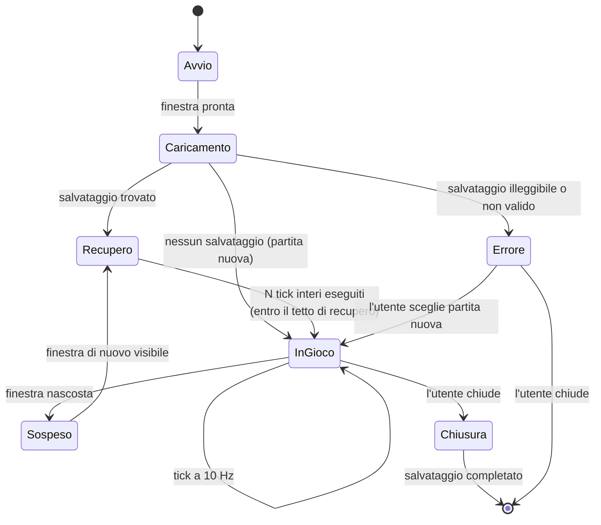

# Ciclo di vita dell'applicazione

Gli stati in cui l'applicazione può trovarsi, e le transizioni ammesse. Serve a rispondere a
domande che altrimenti ognuno risolve a modo suo: _il loop gira mentre carico? cosa succede se
chiudo durante un salvataggio? il tick avanza a finestra ridotta a icona?_

## Le regole che il diagramma stabilisce

**Durante `Caricamento` il loop non gira.** Nessun tick parte prima che `loadAll` sia finito: un
tick su uno stato mezzo caricato produce numeri sbagliati che poi vengono salvati come veri.

**`Recupero` usa lo stesso codice di `InGioco`.** Non è una modalità: è `tickAll` chiamato con un
`n` grande, limitato dal tetto (ADR 0009). Non esiste una "formula offline" da bilanciare a parte
— che è la fonte classica di exploit negli idle game.

**`Sospeso` non fa avanzare nulla.** Quando la finestra torna visibile si passa da `Recupero`, che
è esattamente lo stesso percorso della riapertura del gioco. Un solo meccanismo per due situazioni
che sono la stessa: _è passato del tempo mentre non guardavamo_.

**`Errore` è uno stato, non un crollo.** Un salvataggio illeggibile mostra un messaggio e due
scelte. Non azzera in silenzio: la partita di qualcuno vale più della comodità di non gestire il
caso.

**`Chiusura` attende il salvataggio.** La finestra si chiude dopo che il main ha completato la
scrittura atomica, non prima.

## Quando si salva

| Momento                      | In questa fetta | Nota                                                            |
| ---------------------------- | --------------- | --------------------------------------------------------------- |
| alla chiusura della finestra | **sì**          | è l'unico salvataggio della fetta 01                            |
| a intervalli regolari        | no              | fetta 04, insieme al progresso offline: sono lo stesso problema |
| a ogni transazione           | mai             | scriverebbe su disco dieci volte al secondo                     |
| su richiesta dell'utente     | no              | quando esisterà una schermata che lo offre                      |

Un solo momento di salvataggio nella prima fetta è una scelta: rende il round-trip un percorso
unico e verificabile, invece di tre percorsi che devono coincidere.
