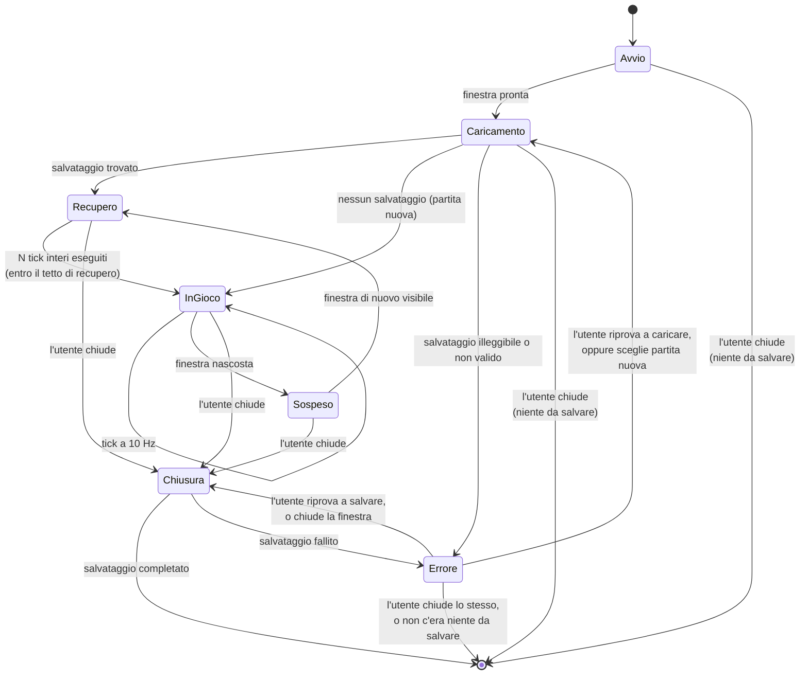

# Ciclo di vita dell'applicazione

Gli stati in cui l'applicazione può trovarsi, e le transizioni ammesse. Serve a rispondere a
domande che altrimenti ognuno risolve a modo suo: _il loop gira mentre carico? cosa succede se
chiudo durante un salvataggio? il tick avanza a finestra ridotta a icona?_

Era un disegno **vincolante**, e da [D011](../delega/D011-runtime-e-store.md) descrive codice che
esiste: la macchina a stati vive in `src/renderer/stores/game.ts`, con i nomi degli stati in
inglese come ogni identificatore (C08) — `startup`, `loading`, `recovering`, `playing`,
`suspended`, `failed`, `closing`. La corrispondenza è uno a uno, e se il codice ne aggiunge uno
questo diagramma cambia nello stesso commit.

## Le regole che il diagramma stabilisce

**Durante `Caricamento` il loop non gira.** Nessun tick parte prima che `loadAll` sia finito: un
tick su uno stato mezzo caricato produce numeri sbagliati che poi vengono salvati come veri.

**`Recupero` usa lo stesso codice di `InGioco`.** Non è una modalità: è `tickAll` chiamato con un
`n` grande, limitato dal tetto (ADR 0009). Non esiste una "formula offline" da bilanciare a parte
— che è la fonte classica di exploit negli idle game.

**`Sospeso` non fa avanzare nulla.** Quando la finestra torna visibile si passa da `Recupero`, che
è esattamente lo stesso percorso della riapertura del gioco. Un solo meccanismo per due situazioni
che sono la stessa: _è passato del tempo mentre non guardavamo_.

**`Errore` è uno stato, non un crollo.** Un salvataggio illeggibile mostra un messaggio e due
scelte. Non azzera in silenzio: la partita di qualcuno vale più della comodità di non gestire il
caso.

**`Errore` ha due cause e una schermata sola**, e le due uscite non coincidono (D012). Da un
**caricamento** fallito si esce ritentando o iniziando una partita nuova. Da un **salvataggio
finale** fallito si esce ritentando, oppure chiudendo lo stesso e perdendo i progressi non
scritti — lì la partita è ancora tutta in memoria, e la finestra è rimasta aperta apposta. Il
codice dell'errore non basta a distinguerle (`error.save.io` esce da entrambe): a dirlo è
`failedDuring` nello store.

**`Chiusura` attende il salvataggio.** La finestra si chiude dopo che il main ha completato la
scrittura atomica, non prima. Se quella scrittura fallisce la finestra **non** si chiude: si passa
in `Errore`, che è l'unico arco che entra in quello stato senza venire da `Caricamento`.

**Si scrive solo da uno stato che ha una partita da salvare (INV-17).** Chiudere la finestra è un
gesto disponibile in **ogni** stato, e non da tutti passa per `Chiusura`: da `Avvio`, da
`Caricamento` e da `Errore` per un **caricamento** fallito il modello in memoria non è mai stato
caricato — è una partita nuova, azzerata, che non rappresenta nessuno. Lì la finestra si chiude e
basta, senza toccare il disco.

Non è una precauzione teorica: prima di [D016](../delega/D016-correzioni-audit.md) quel gesto
scriveva la partita azzerata **sopra** il salvataggio del giocatore, mentre la schermata d'errore
gli stava promettendo che il file non era stato modificato. La precondizione vive in `close()`,
che è l'unica funzione che sa cosa sta per scrivere — non in chi la chiama, dove sarebbe la stessa
omissione spostata di un file.

`Errore` per un **salvataggio** fallito va nella direzione opposta: lì la partita è tutta in
memoria e non è mai arrivata sul disco, quindi chiudere la finestra è un altro modo di dire
«riprova». A perdere qualcosa è solo la scelta esplicita, che ha un pulsante suo.

## Quando si salva

| Momento                      | In questa fetta | Nota                                                            |
| ---------------------------- | --------------- | --------------------------------------------------------------- |
| alla chiusura della finestra | **sì**          | è l'unico salvataggio della fetta 01                            |
| a intervalli regolari        | no              | fetta 03, insieme al progresso offline: sono lo stesso problema |
| a ogni transazione           | mai             | scriverebbe su disco dieci volte al secondo                     |
| su richiesta dell'utente     | no              | quando esisterà una schermata che lo offre                      |

Un solo momento di salvataggio nella prima fetta è una scelta: rende il round-trip un percorso
unico e verificabile, invece di tre percorsi che devono coincidere.
