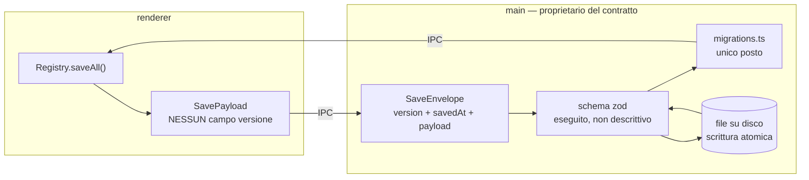
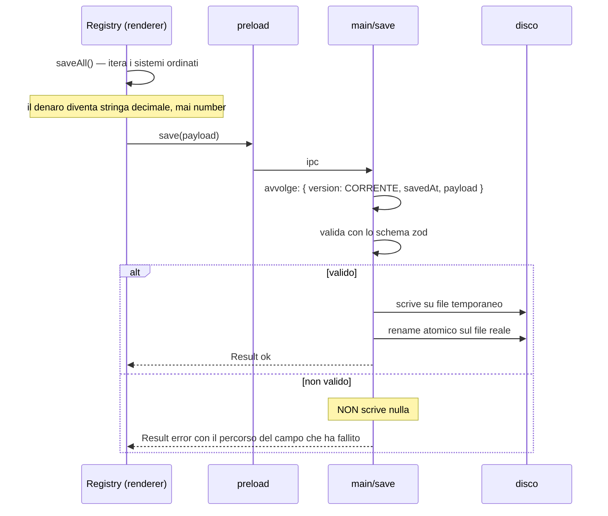
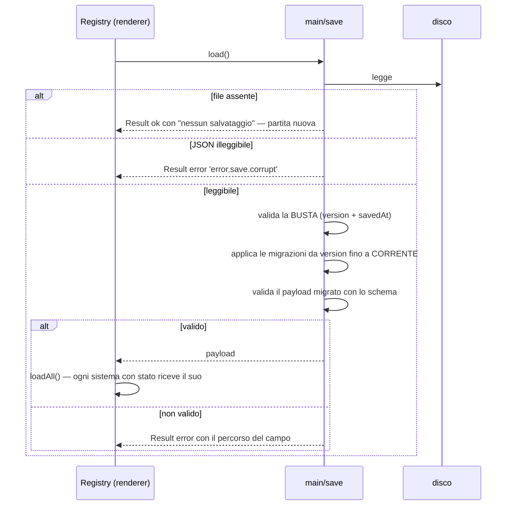
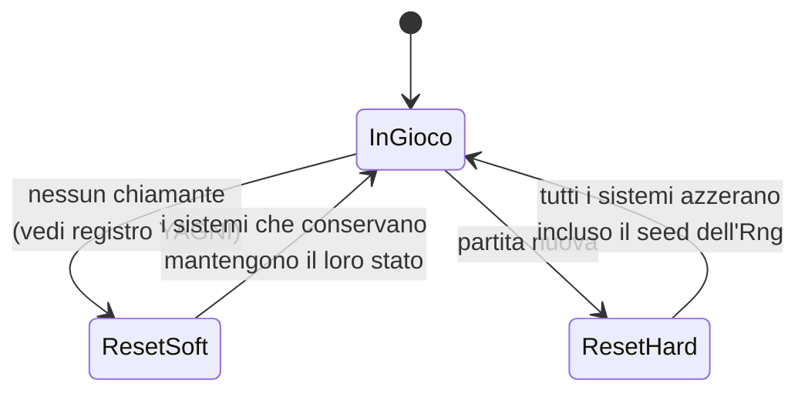

# Flusso di salvataggio e caricamento

Il confine più importante del progetto, e quello che nella versione precedente era una finzione.

Questo era un disegno **vincolante**, e da [D009](../delega/D009-persistenza-main.md) descrive
codice che esiste: lo schema `zod`, la scrittura atomica, le migrazioni e i tre canali IPC stanno
in `src/main/save/`, e `tests/save/` li attraversa. Resta vincolante per una cosa sola, ed è la
riga del reset: il lato renderer — `resetAll(scope)` dal Registry — esiste da
[D011](../delega/D011-runtime-e-store.md), dentro `createGame().reset(scope)`.

Decisioni rilevanti: [ADR 0004](../adr/0004-il-main-e-proprietario-del-contratto-di-salvataggio.md),
[ADR 0006](../adr/0006-decimal-end-to-end-per-il-denaro.md),
[ADR 0010](../adr/0010-liste-storiche-limitate-alla-definizione.md).

## Chi possiede cosa

La riga che conta: **il renderer non ha un tipo con un campo versione**. Non è una convenzione da
rispettare, è una cosa che non si può scrivere.

## Salvataggio

Il file temporaneo più rename non è pignoleria: senza, un crollo a metà scrittura lascia un
salvataggio troncato, cioè la partita persa.

Un payload non valido **non viene scritto**. Un salvataggio corrotto sul disco è peggio di un
salvataggio mancato: il secondo si ripete, il primo si scopre al caricamento successivo.

## Caricamento

Il payload si valida **dopo** la migrazione, non prima: prima della migrazione ha la forma
vecchia, e validarlo contro lo schema corrente fallirebbe sempre.

### `loadAll` non è atomico, e a fornire l'atomicità è chi lo chiama

Il Ledger valida **tutti** i movimenti prima di toccarne uno (INV-09): una transazione non è mai
applicata a metà. `Registry.loadAll` non fa lo stesso, e va detto: consegna lo stato a un sistema
alla volta, quindi se il terzo rifiuta il proprio — un `load` che lancia è un esito, non un crollo
(ADR 0002) — i primi due sono già caricati.

Ciò che rende la cosa innocua non è il Registry: è il chiamante. `createGame().load()` ritorna
`error.registry.load_failed`, lo store va in `Errore` e da lì **non si gioca** — si ricarica da
capo o si comincia una partita nuova, e in entrambi i casi lo stato a metà viene sostituito prima
che qualcuno lo veda. È anche la ragione per cui INV-17 vieta di scrivere da quello stato: un
modello a metà non è una partita.

Renderlo atomico costerebbe due fasi — chiedere a tutti di validare, poi chiedere a tutti di
applicare — cioè un contratto in più per un solo sistema con stato. Il grilletto è già nel
[registro YAGNI](../roadmap-fette.md): _un meccanismo condiviso per validare lo stato salvato di
un sistema_, al **secondo** dominio con stato. Fino ad allora questa riga è la garanzia, e vale
quanto vale.

## Gli esiti attraversano il confine

I `Result` dei due diagrammi qui sopra hanno una forma precisa, e vive in `core/contracts/save.ts`
insieme al resto del contratto. Non è una comodità: INV-03 lascia al main **quel file e nient'altro**,
quindi un tipo d'esito che stesse altrove non sarebbe importabile dal main — e la risposta sbagliata
a quel problema è allargare INV-03.

| Codice                     | Quando                                                 | Cosa porta con sé             |
| -------------------------- | ------------------------------------------------------ | ----------------------------- |
| `error.save.corrupt`       | il file c'è ma non è JSON                              | —                             |
| `error.save.invalid`       | lo schema ha rifiutato la busta o il payload           | il percorso del campo         |
| `error.save.version_ahead` | la busta viene da una versione più nuova del programma | versione trovata e supportata |
| `error.save.io`            | lettura o scrittura fallita                            | il messaggio, non l'`Error`   |

L'ultima riga non è pignoleria: un `Error` non sopravvive alla clonazione strutturata dell'IPC e
arriverebbe dall'altra parte come `{}`.

**Il file assente non è un errore.** `load()` ritorna `ok` con `{ present: false }`: è una partita
nuova, non un guasto. Confonderli è il modo più veloce di mostrare una schermata di errore a chi ha
appena installato il gioco.

## Politica di versionamento

| Modifica al payload                                | Serve una migrazione?                       | Serve alzare la versione? |
| -------------------------------------------------- | ------------------------------------------- | ------------------------- |
| aggiungo un campo con un valore di default sensato | no, il default basta                        | sì                        |
| aggiungo un campo senza default sensato            | **sì**                                      | sì                        |
| rinomino un campo                                  | **sì**                                      | sì                        |
| cambio il tipo di un campo                         | **sì**                                      | sì                        |
| tolgo un campo                                     | no, si ignora                               | sì                        |
| aggiungo un sistema nuovo con stato                | no, `loadAll` tratta l'assenza come "nuovo" | sì                        |

Una migrazione:

- prende il **payload** della versione N e ritorna quello della N+1. Mai due salti in una
  funzione: la firma è `(payload: unknown) => unknown`, quindi il numero di versione lo scrive il
  runner e una migrazione non ha dove sbagliarlo. Fino a D009 questa riga diceva "prende la busta
  e ritorna la busta", che lasciava il salto a chi scrive la migrazione.
- è **pura**: nessuna lettura di file, nessuna data corrente, nessun caso "se il campo esiste".
- ha un test con un salvataggio reale della versione N, tenuto in `tests/save/fixtures/`.

La versione 1 non ha migrazioni: non c'è nulla da cui migrare. La prima migrazione nasce con la
versione 2 (vedi il registro YAGNI in [roadmap-fette.md](../roadmap-fette.md)). Il **runner** che
le applica, invece, esiste già: prende la mappa e la versione di arrivo per parametro, così la
catena si prova adesso con migrazioni finte invece che il giorno in cui serve.

## Reset

Il reset non è un caso particolare del caricamento: è una terza operazione, con il suo ambito.

`resetAll(scope)` passa dal Registry esattamente come `saveAll` e `loadAll`: stessa lista, stesso
ordine, nessuna eccezione. Nel progetto precedente il reset da prestige era orchestrato dentro un
componente Vue (difetto A09), ed è il motivo per cui `reset` è nel tipo `System` e non altrove.

**`soft` non è "un hard più leggero".** Ogni sistema decide cosa conserva, e lo decide nel proprio
file — non in una lista di eccezioni centralizzata, che è la forma in cui questo si degrada.

**Oggi `soft` non ha un chiamante**, ed è onesto dirlo qui invece di lasciarlo scoprire a chi legge
il codice. Il prestige era il suo unico significato dichiarato, e la
[visione](../prodotto/visione.md) riscritta il 2026-08-20 lo toglie. Il valore resta nel tipo con
una domanda aperta nel [registro YAGNI](../roadmap-fette.md): o prende un significato nuovo —
ricominciare **con lo stesso mondo**, contro `hard` che ne semina uno diverso — o esce. Non gliene
va inventato uno prima che serva.

### Il canale `reset` del main è un'altra cosa

Il diagramma qui sopra è tutto nel renderer: `ResetScope` vive in `contracts/lifecycle.ts`, che
INV-03 **non** concede al main. Il terzo canale IPC non porta quindi nessun ambito e fa una cosa
sola: **cancella il file di salvataggio**. Cancellare un file che non c'è è `ok`, non un errore.

Sono due operazioni con lo stesso nome, e vanno tenute distinte: il reset del renderer decide cosa
il gioco conserva, quello del main decide cosa resta sul disco. Un reset parziale chiamerebbe il
primo e non il secondo.
