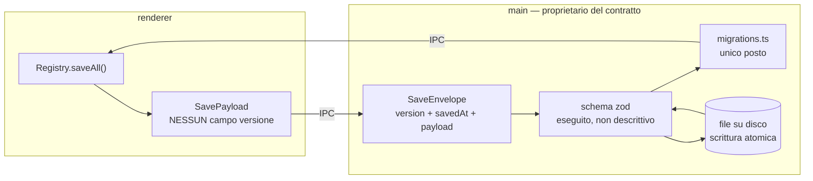
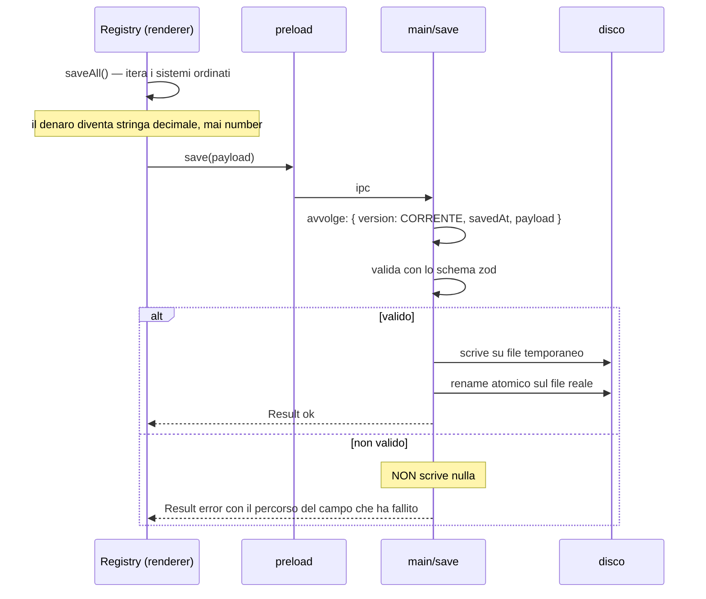
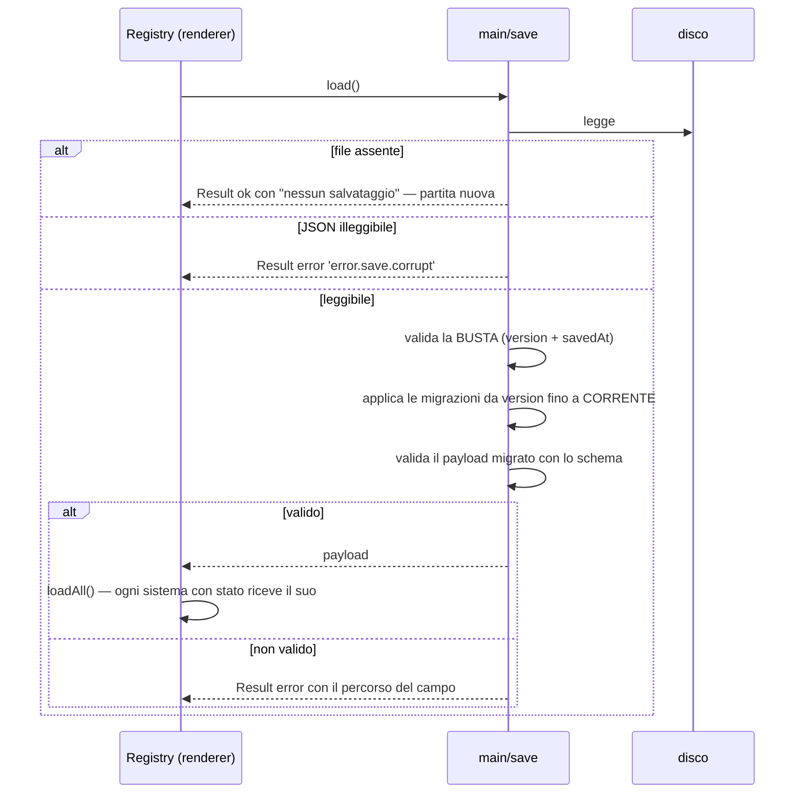
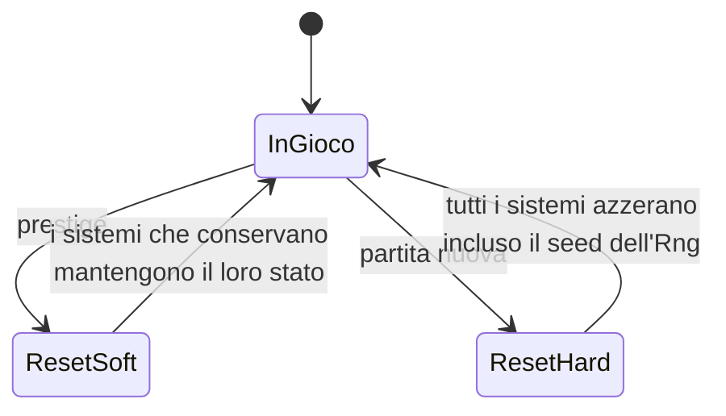

# Flusso di salvataggio e caricamento

Il confine più importante del progetto, e quello che nella versione precedente era una finzione.

Questo è un disegno **vincolante**, non una descrizione: dei pezzi qui sotto esistono solo i
contratti (`core/contracts/save.ts`, [D002](../delega/D002-contratti.md)) e il lato renderer del
Registry e del Ledger. Lo schema, il file su disco, le migrazioni e l'IPC **non esistono ancora**:
li scrive [D009](../delega/D009-persistenza-main.md), e devono corrispondere a questo.

Decisioni rilevanti: [ADR 0004](../adr/0004-il-main-e-proprietario-del-contratto-di-salvataggio.md),
[ADR 0006](../adr/0006-decimal-end-to-end-per-il-denaro.md),
[ADR 0010](../adr/0010-liste-storiche-limitate-alla-definizione.md).

## Chi possiede cosa

La riga che conta: **il renderer non ha un tipo con un campo versione**. Non è una convenzione da
rispettare, è una cosa che non si può scrivere.

## Salvataggio

Il file temporaneo più rename non è pignoleria: senza, un crollo a metà scrittura lascia un
salvataggio troncato, cioè la partita persa.

Un payload non valido **non viene scritto**. Un salvataggio corrotto sul disco è peggio di un
salvataggio mancato: il secondo si ripete, il primo si scopre al caricamento successivo.

## Caricamento

Il payload si valida **dopo** la migrazione, non prima: prima della migrazione ha la forma
vecchia, e validarlo contro lo schema corrente fallirebbe sempre.

## Politica di versionamento

| Modifica al payload                                | Serve una migrazione?                       | Serve alzare la versione? |
| -------------------------------------------------- | ------------------------------------------- | ------------------------- |
| aggiungo un campo con un valore di default sensato | no, il default basta                        | sì                        |
| aggiungo un campo senza default sensato            | **sì**                                      | sì                        |
| rinomino un campo                                  | **sì**                                      | sì                        |
| cambio il tipo di un campo                         | **sì**                                      | sì                        |
| tolgo un campo                                     | no, si ignora                               | sì                        |
| aggiungo un sistema nuovo con stato                | no, `loadAll` tratta l'assenza come "nuovo" | sì                        |

Una migrazione:

- prende la busta della versione N e ritorna quella della N+1. Mai due salti in una funzione.
- è **pura**: nessuna lettura di file, nessuna data corrente, nessun caso "se il campo esiste".
- ha un test con un salvataggio reale della versione N, tenuto in `tests/save/fixtures/`.

La versione 1 non ha migrazioni: non c'è nulla da cui migrare. La prima migrazione nasce con la
versione 2 (vedi il registro YAGNI in [roadmap-fette.md](../roadmap-fette.md)).

## Reset

Il reset non è un caso particolare del caricamento: è una terza operazione, con il suo ambito.

`resetAll(scope)` passa dal Registry esattamente come `saveAll` e `loadAll`: stessa lista, stesso
ordine, nessuna eccezione. Nel progetto precedente il reset da prestige era orchestrato dentro un
componente Vue (difetto A09), ed è il motivo per cui `reset` è nel tipo `System` e non altrove.

**`soft` non è "un hard più leggero".** Ogni sistema decide cosa conserva, e lo decide nel proprio
file — non in una lista di eccezioni centralizzata, che è la forma in cui questo si degrada.
