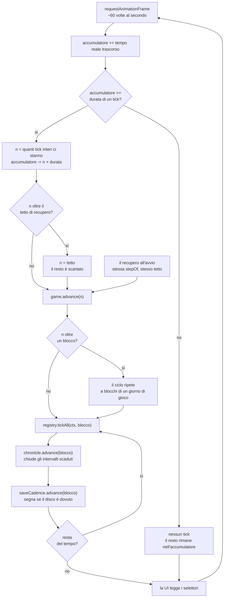
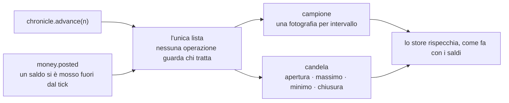
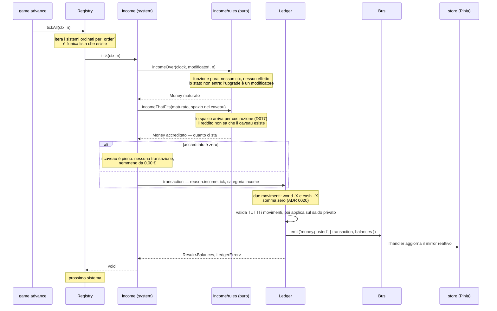
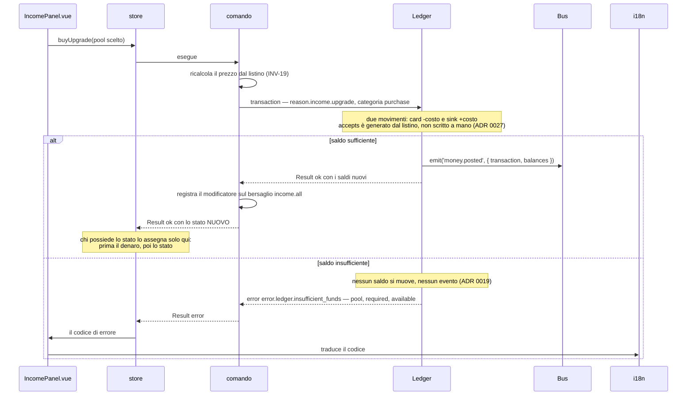

# Flusso di un tick

Cosa succede fra un frame del browser e un cambiamento di saldo. È il disegno **vincolante** del
loop della fetta 01. Il Ledger esiste da [D007](../delega/D007-kernel-ledger.md) e il sistema
`income` da [D010](../delega/D010-dominio-income.md); il **loop** che li fa girare esiste da
[D011](../delega/D011-runtime-e-store.md), in `src/renderer/runtime/loop.ts`. La regola
dell'accumulatore è una funzione pura, `stepOf`, ed è la **stessa** che decide i tick arretrati
all'avvio: non esiste una formula offline separata. Se il loop cambia, questo file cambia nello
stesso commit.

Decisioni rilevanti: [ADR 0009](../adr/0009-passo-fisso-e-tipi-branded-per-il-tempo.md) (passo
fisso), [ADR 0002](../adr/0002-registry-unica-lista-di-sistemi.md) (chi itera),
[ADR 0016](../adr/0016-il-bus-e-sincrono-e-fire-and-forget.md) (il Bus è sincrono),
[ADR 0019](../adr/0019-transazioni-atomiche-nel-ledger.md) (la primitiva è la transazione),
[ADR 0020](../adr/0020-partita-doppia.md) (ogni transazione somma a zero) e
[ADR 0043](../adr/0043-il-tempo-che-avanza-e-un-operazione-del-gioco.md) (il tempo avanza in un
posto solo).

## Dal frame al tick

Il browser chiama a ~60 Hz, la simulazione avanza a 10 Hz. L'accumulatore fa da cuscinetto: il
tempo frazionario non si perde e non si conta due volte.

Il tetto di recupero serve a un caso solo ma importante: riaprire il gioco dopo giorni non deve
bloccare l'avvio per minuti. Il tetto è un dato in `balance/constants.ts`, non un numero nel loop, e
da [D040](../delega/D040-il-recupero-avanza-a-blocchi.md) si misura in **giorni di gioco**: le ore
reali erano l'unità sbagliata per un mondo il cui giorno dura due secondi.

**Il ciclo dentro `advance` è la seconda cosa che D040 ha aggiunto, e sta lì di proposito.** Un
intervallo lungo non arriva ai sistemi in un colpo: viene camminato a blocchi di un giorno di gioco,
perché una soglia attraversata e rientrata dentro un salto unico non scatta mai. A spezzare è
`advance` e non chi lo chiama — se fosse del chiamante, ogni chiamante nuovo potrebbe dimenticarsene
in silenzio, e R25 resterebbe verde mentre la sua ragione viene aggirata.

**Il terzo nodo del blocco è di [D041](../delega/D041-il-salvataggio-ha-una-cadenza.md), e non
registra: segna.** La cadenza del salvataggio riceve lo stesso blocco che ricevono i sistemi e la
cronaca, e l'unica cosa che fa è alzare un `boolean` quando la soglia è passata. **Non scrive**: a
scrivere è lo store, al primo frame utile, perché è l'unico che ha `SaveApi` sotto mano e perché una
scrittura è asincrona dentro un ciclo che è sincrono. Che sia un `boolean` e non un contatore è la
riga che regge il recupero: 7.300 tick attraversano la soglia ventiquattro volte in tre millisecondi,
e ventiquattro cose dovute sono **una** cosa da fare ([ADR 0050](../adr/0050-la-cadenza-sta-sulla-via-unica.md)).

**Le due frecce che entrano in `advance` sono il punto del disegno.** Il passo del frame e il
recupero all'avvio sono lo stesso fatto — _è passato del tempo mentre non guardavamo_ — e da
[D037](../delega/D037-il-tempo-che-avanza-e-un-operazione-del-gioco.md) passano dalla stessa
funzione. Fino ad allora erano due sequenze scritte a mano, e una delle due si era già dimenticata
la metà che registra: chi chiudeva il gioco e lo riapriva dopo una notte incassava lo stipendio
arretrato e ritrovava i grafici vuoti. **R25** (`tests/rules/one-way-to-advance`) tiene la freccia
una sola.

## La cronaca

Ciò che il tempo lascia dietro di sé. Non è un sistema e non entra nel salvataggio: è una lista di
**registrazioni** — cosa osservare, ogni quanti tick, quante tenerne — dichiarate nel bootstrap
accanto ai sistemi.

Le due forme si distinguono per **chiusura** e non per un `if`: un campione ignora ciò che succede
in mezzo, una candela ci tiene l'escursione. È la forma del Registry applicata a ciò che si
registra invece che a ciò che ticchetta, e il primo `if` sul tipo di registrazione è il difetto A01
che torna con un altro nome.

## Dentro `tickAll`

Un solo passaggio, in ordine di `order`. Nessun sistema conosce gli altri: comunicano solo
attraverso il Ledger e il Bus.

Cinque punti che il diagramma rende visibili meglio di qualsiasi paragrafo:

1. **Il sistema non tocca mai un saldo.** Chiede al Ledger, che gli risponde con un `Result`.
2. **Il reddito non nasce dal nulla: esce da `world`.** Il sistema non nomina `world` a mano — lo
   fa il costruttore `income()` del Ledger (INV-10). Se un movimento solo bastasse, la somma di
   tutti i conti smetterebbe di essere zero e la partita doppia sarebbe una decorazione.
3. **Il calcolo è nella funzione pura**, che non riceve il contesto — nemmeno il `Clock`, che
   arriva per argomento come qualunque altro dato. È testabile da sola, senza impalcature. Non
   riceve lo **stato** del sistema: l'upgrade agisce come modificatore, quindi nel calcolo del
   reddito lo stato non ha parte (D010, correzione 4).
4. **Lo store è un lettore, non una fonte.** Riceve dal Bus, non calcola. Se lo store calcolasse,
   il gioco non sarebbe simulabile senza Vue — e cadrebbe l'ADR 0001.
5. **Il reddito sa quanto ci sta prima di chiedere**, ed è il ramo che
   [D017](../delega/D017-il-caveau.md) ha aggiunto. Non chiede e incassa il rifiuto: una
   transazione è atomica (ADR 0019), quindi una da tutto lo stipendio arretrato verrebbe rifiutata
   intera e chi torna dopo una notte tornerebbe con zero a caveau pieno. **D040 ha abbassato la
   pressione che l'ha prodotto** — con i blocchi la transazione gigante non esiste più, e il caveau
   si riempie un giorno di gioco alla volta — ma il ramo resta corretto e serve al tempo reale. Lo spazio arriva
   per costruzione, non da un import: `income` non nomina il caveau, e a collegarli è il bootstrap
   (ADR 0024). Quello che resta fuori non sparisce in silenzio — il sistema lo espone, e la
   schermata dei contanti lo dice.

## Un comando che può fallire

L'acquisto di un upgrade. Stesso disegno, direzione opposta: parte dalla UI.

Il componente non sa cosa sia un saldo insufficiente: riceve un codice e lo traduce. È la
differenza fra un `boolean` e un `Result` (ADR 0007), e la ragione per cui i codici di errore sono
chiavi i18n e non frasi.
