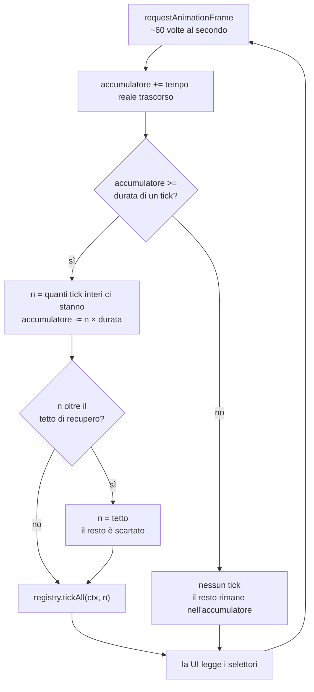
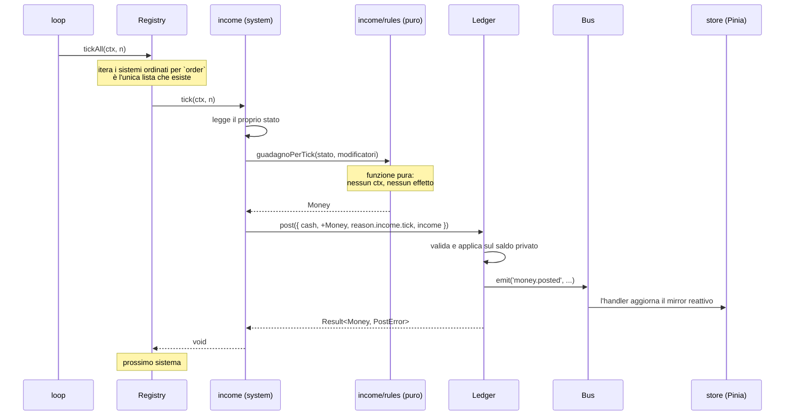
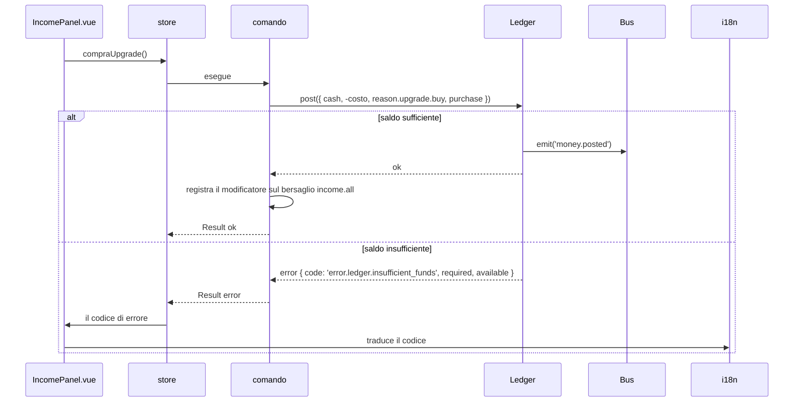

# Flusso di un tick

Cosa succede fra un frame del browser e un cambiamento di saldo. Descrive lo stato **corrente**
del progetto; se il loop cambia, questo file cambia nello stesso commit.

Decisioni rilevanti: [ADR 0009](../adr/0009-passo-fisso-e-tipi-branded-per-il-tempo.md) (passo
fisso), [ADR 0002](../adr/0002-registry-unica-lista-di-sistemi.md) (chi itera),
[ADR 0016](../adr/0016-il-bus-e-sincrono-e-fire-and-forget.md) (il Bus è sincrono).

## Dal frame al tick

Il browser chiama a ~60 Hz, la simulazione avanza a 10 Hz. L'accumulatore fa da cuscinetto: il
tempo frazionario non si perde e non si conta due volte.

Il tetto di recupero serve a un caso solo ma importante: riaprire il gioco dopo giorni non deve
bloccare l'avvio per minuti. Il tetto è un dato in `balance/constants.ts`, non un numero nel loop.

## Dentro `tickAll`

Un solo passaggio, in ordine di `order`. Nessun sistema conosce gli altri: comunicano solo
attraverso il Ledger e il Bus.

Tre punti che il diagramma rende visibili meglio di qualsiasi paragrafo:

1. **Il sistema non tocca mai un saldo.** Chiede al Ledger, che gli risponde con un `Result`.
2. **Il calcolo è nella funzione pura**, che non riceve il contesto. È testabile da sola con un
   seed fisso e senza impalcature.
3. **Lo store è un lettore, non una fonte.** Riceve dal Bus, non calcola. Se lo store calcolasse,
   il gioco non sarebbe simulabile senza Vue — e cadrebbe l'ADR 0001.

## Un comando che può fallire

L'acquisto di un upgrade. Stesso disegno, direzione opposta: parte dalla UI.

Il componente non sa cosa sia un saldo insufficiente: riceve un codice e lo traduce. È la
differenza fra un `boolean` e un `Result` (ADR 0007), e la ragione per cui i codici di errore sono
chiavi i18n e non frasi.
