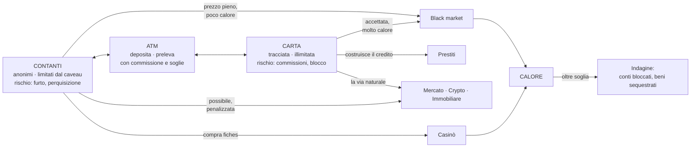

# Visione di prodotto

Cosa sarà Solvent quando sarà finito. Serve a due cose: dare un bersaglio alle decisioni di oggi,
e dire chiaramente cosa **non** si costruisce adesso.

Le meccaniche qui sotto nascono dal progetto precedente, preso come **catalogo di idee** — non di
codice e non di strutture. Ciò che era stato capito bene lì è la profondità dei domini; ciò che
era stato capito male è come collegarli.

Solvent non ha un'attività principale con dei contorni. È un **ecosistema**: dodici domini che si
contendono le stesse tre risorse, e una progressione che li apre uno dopo l'altro rendendo
insufficiente ciò che bastava prima.

---

## Il principio: la profondità viene dalle connessioni

Un dominio profondo non è un dominio con più pannelli. È un dominio le cui scelte **cambiano cosa
puoi fare altrove**.

| Superficiale                          | Profondo                                                                           |
| ------------------------------------- | ---------------------------------------------------------------------------------- |
| Un nodo di skill dà +5% reddito       | Un nodo di skill ti fa _vedere_ il valore stimato di un lotto prima di puntare     |
| Un evento dà +10% per 5 minuti        | Un evento chiude il black market per due ore e fa crollare l'immobiliare           |
| Il prestige dà un moltiplicatore      | Ogni era **cambia le regole**: la seconda apre il mercato nero, la terza le crypto |
| Il black market è uno shop con sconti | Il black market ha calore, reputazione e indagini: il prezzo è il rischio          |
| Il casinò è un generatore di numeri   | Le fiches sono una terza valuta con spread; il banco vince sempre un po'           |
| L'affitto è un incasso mensile        | L'affitto è un contratto con un inquilino che può pagare tardi, o non pagare       |

**Regola operativa:** un dominio nuovo non entra finché non si sa dire a quali **due** altri
domini si collega e come. Un dominio che si collega solo al saldo è un minigioco, non un sistema.

---

## Le tre risorse scarse

Il denaro non è la risorsa scarsa di un idle: cresce sempre, per definizione. Le risorse vere sono
tre, e ogni dominio ne consuma almeno una.

| Risorsa                          | Cosa la consuma                                             | Cosa la restituisce                              | Il tetto che impone                     |
| -------------------------------- | ----------------------------------------------------------- | ------------------------------------------------ | --------------------------------------- |
| **Denaro**                       | tutto                                                       | tutto                                            | nessuno: è il punteggio, non il limite  |
| **Calore** (quanto sei visibile) | black market, riciclaggio, insider trading, contanti grossi | il tempo che passa, i consulenti, la reputazione | l'indagine: conti bloccati, sequestri   |
| **Attenzione** (quanto segui)    | ogni entità gestita a mano: attività, immobili, posizioni   | delegare — e delegare costa margine ed errori    | quante cose puoi davvero tenere in aria |

**Perché non basta il denaro.** Un gioco in cui l'unico limite è quanto hai finisce quando ne hai
abbastanza. Calore e attenzione sono limiti che il denaro non compra: si possono spostare, mai
eliminare. Sono loro a rendere una scelta una scelta.

---

## La spina dorsale: contanti, carta, calore

Tutto il gioco ruota attorno a una tensione sola, e ogni dominio è un modo diverso di viverla:

**Perché funziona:** i contanti sono veloci e liberi ma non scalano — il caveau ha una capacità, e
il denaro fermo non rende. La carta scala all'infinito ma lascia tracce e ti lega alle regole. Ogni
volta che il giocatore guadagna, deve decidere dove mettere quei soldi, e quella decisione ha
conseguenze a tre domini di distanza.

Senza questa tensione, dodici domini sono dodici pulsanti che fanno salire lo stesso numero.

---

## La progressione: quattro ere, quattro muri

La progressione non è "i numeri salgono". Ogni era **rende insufficiente la strategia dell'era
precedente**, e il muro che la chiude non si compra: si supera cambiando modo di giocare.

| Era              | Cosa impari                                      | Il muro che ti ferma                                                                                 | Domini che apre                                                        |
| ---------------- | ------------------------------------------------ | ---------------------------------------------------------------------------------------------------- | ---------------------------------------------------------------------- |
| **1 — Contanti** | guadagni col tempo e te li tieni addosso         | **il caveau si riempie.** I contanti non scalano, e portarli in banca lascia tracce                  | reddito, bancomat, caveau, calore, black market, aste di box, negozio  |
| **2 — Capitale** | i soldi smettono di stare fermi                  | **il punteggio di credito.** La leva ha un tetto che non si compra: si costruisce, e si può azzerare | depositi vincolati, prestiti, mercato azionario, immobiliare e affitti |
| **3 — Impresa**  | smetti di fare cose e possiedi cose che le fanno | **l'attenzione.** Oltre poche entità servono manager: costano margine e sbagliano                    | impresa con più attività, casinò, crypto, immobiliare a portafoglio    |
| **4 — Rete**     | le regole diventano il terreno di gioco          | **il calore accumulato.** Tutto ciò che hai fatto torna indietro insieme                             | indagini, reputazione, eventi che cambiano le regole, albero abilità   |

Il **prestige** non è una quinta era: è ciò che riscrive le quattro. Ricominciare cambia le regole
— quali domini sono aperti da subito, dove stanno le soglie di calore, di che materiale è la carta
— non solo i moltiplicatori.

### La difficoltà, in concreto

Quattro fonti, nessuna delle quali è "i numeri richiesti diventano più grandi":

1. **I muri.** Ogni era ne ha uno che il denaro non apre.
2. **Le conseguenze vere.** Un'insolvenza escute le garanzie e blocca la carta. Un'indagine
   sequestra. Un'attività senza budget chiude. Nessuna di queste è un pop-up: sono stati da cui si
   esce giocando.
3. **L'informazione imperfetta.** Un lotto d'asta si vede a metà, un titolo non dice dove andrà.
   La skill riduce l'incertezza, non la elimina — se la eliminasse, la scelta sparirebbe.
4. **Il costo opportunità.** Attenzione e capitale finiti significa che scegliere un dominio è
   rinunciare a un altro **adesso**, non per sempre.

### L'ordine di costruzione non è l'ordine di gioco

Le ere dicono in che ordine il giocatore incontra i domini. Le **fette** dicono in che ordine li
costruiamo noi, e l'ordine è diverso: una fetta si sceglie per quanto mette alla prova il kernel,
non per dove sta nella storia. Il prestige, per esempio, è era 4 nel gioco e fetta 06 nel lavoro,
perché è la prima cosa che stressa `ResetScope` su molti sistemi insieme.
Il registro sta in [roadmap-fette.md](../roadmap-fette.md).

---

## La mappa dei domini

Colonna "ciclo": il loop di gioco. Colonna "si collega a": le connessioni che lo rendono
ammissibile. La profondità di ognuno è specificata subito sotto.

| Dominio                  | Era | Ciclo                                                         | Si collega a                                      |
| ------------------------ | --- | ------------------------------------------------------------- | ------------------------------------------------- |
| **Reddito**              | 1   | il tempo passa → i soldi entrano                              | contanti, carta, skill                            |
| **Bancomat**             | 1   | deposita → preleva, con commissione e soglie                  | contanti, carta                                   |
| **Caveau**               | 1   | conserva contanti e oggetti                                   | contanti, oggetti, black market                   |
| **Calore**               | 1   | accumula visibilità → aspetta o ripulisci                     | tutti i domini grigi                              |
| **Black market**         | 1   | sblocca contatti → tratta → incassa                           | contanti, calore, skill, tutto ciò che si rivende |
| **Aste di box**          | 1   | punta al buio su un lotto → apri → valuta → rivendi           | skill, negozio, caveau                            |
| **Negozio**              | 1   | compra → restaura → rivendi o metti all'asta                  | aste, black market, caveau                        |
| **Prestiti**             | 2   | chiedi → usa la leva → rimborsa                               | carta, immobiliare, calore                        |
| **Depositi vincolati**   | 2   | blocca una somma per N tempo → riscuoti                       | carta, prestiti                                   |
| **Mercato (azioni)**     | 2   | analizza → apri posizione → gestisci → chiudi                 | eventi, black market (soffiate), prestiti (leva)  |
| **Immobiliare**          | 2   | compra in un distretto → migliora → affitta o rivendi         | prestiti (garanzia), impresa (sedi), eventi       |
| **Impresa**              | 3   | compra attività → assumi → apri filiali → regola le politiche | skill, prestiti, immobiliare                      |
| **Casinò**               | 3   | cambia contanti in fiches → gioca → ricambia                  | contanti, calore                                  |
| **Crypto**               | 3   | come il mercato, ma peggio                                    | contanti, calore, black market                    |
| **Albero delle abilità** | 3   | guadagna punti → scegli il ramo                               | tutti                                             |
| **Eventi periodici**     | 4   | accadono → duri o approfitti                                  | tutti                                             |
| **Indagini**             | 4   | il calore sfonda → subisci → ti difendi                       | tutti i domini grigi                              |
| **Prestige e ere**       | 4   | raggiungi i traguardi → ricominci cambiando le regole         | tutti                                             |

---

## La profondità, dominio per dominio

Qui "profondo" smette di essere un aggettivo. Ogni sezione dice cosa deve esistere perché il
dominio sia un sistema e non un pannello.

### Impresa — più attività, ognuna con il suo budget

Il giocatore possiede da una a molte attività. Ognuna è un'entità con vita propria:

- **Un budget suo.** Non un numero del dominio: un conto vero nel libro mastro
  ([ADR 0022](../adr/0022-il-ledger-ha-conti-non-solo-pool.md)). Ci si versa e si preleva, e il
  bilancio dell'attività — cassa, ricavi, costi, margine — si **legge** dal Ledger invece di
  essere ricostruito.
- **Una sede.** Affittata o di proprietà: è il collegamento diretto con l'immobiliare. Il
  distretto della sede decide il passaggio, quindi la domanda.
- **Persone.** Assumere è un costo fisso che non cala quando cala il fatturato: è ciò che rende
  un'attività capace di fallire.
- **Politiche con trade-off reale.** Prezzo alto = margine alto e volume basso. Qualità alta =
  reputazione che cresce lentamente e costi che crescono subito. Orari lunghi = più ricavi e più
  turnover del personale. Nessuna politica è dominante: ognuna sposta due numeri in direzioni
  opposte.
- **Uno stato che cambia da solo.** Domanda locale, scorte, reputazione, usura. Un'attività
  lasciata sola non resta ferma: peggiora.
- **Il fallimento.** Budget sotto zero oltre il fido = insolvenza. L'attività chiude, i debiti
  restano, e il punteggio di credito ne risente.
- **Sinergie e filiali.** Due attività dello stesso settore condividono fornitori; una catena
  costa meno della somma delle sue parti — ma consuma più attenzione.

**Il muro dell'era 3 vive qui.** Oltre poche attività non si arriva a regolarle a mano: si assume
un manager, che prende una percentuale, applica le politiche in modo approssimato e ogni tanto
sbaglia. Delegare non è gratis, ed è l'unico modo di crescere.

### Immobiliare e affitti — un contratto, non un incasso

Il canone non è un numero che entra ogni mese. È un **contratto con una controparte**.

- **La città ha distretti**, ognuno con tendenze proprie: prezzo, domanda di affitti, degrado. Un
  distretto può gentrificarsi o affondare, e non per caso: gli eventi lo muovono.
- **L'immobile** ha tipo, condizione, valore di mercato e canone potenziale. Le **migliorie**
  cambiano rendita e valore in modo **diverso**: rifare il bagno alza il canone, rifare la facciata
  alza il valore. Sceglierne una è scegliere fra rendita e plusvalenza.
- **L'inquilino** ha un contratto con durata, canone, deposito cauzionale, e un'affidabilità che
  non si vede tutta prima di firmare. Paga puntuale, paga tardi, smette di pagare.
- **Lo sfratto** costa tempo e denaro, e nel frattempo il canone non entra.
- **Lo sfitto** esiste: fra un contratto e l'altro l'immobile costa e non rende. È la ragione per
  cui la rendita lorda e quella netta sono due numeri diversi, ed è la lezione del dominio.
- **La manutenzione** non è opzionale. I guasti accadono; se non ripari, la condizione cala, il
  canone cala, e alla scadenza l'inquilino non rinnova.
- **Le tasse e il mutuo.** Un immobile comprato a leva rende molto o distrugge, secondo se il
  canone copre la rata. È il collegamento con i prestiti, ed è la prima volta che la leva ha un
  senso positivo.

### Aste e garage wars — comprare informazione

Il ciclo rischio/informazione più puro del gioco.

- **Il lotto si vede a metà.** Un'anteprima, non un inventario. La **perizia** (skill) restringe
  l'intervallo di valore stimato: lo riduce, non lo azzera.
- **Gli altri offerenti sono avversari**, non rumore: hanno budget, stile e pazienza diversi. Uno
  rilancia sempre di poco, uno sparisce sopra una soglia, uno ti fa salire di proposito.
- **Le garage wars sono una sessione**: più lotti, **un budget totale**. Vincere il primo lotto
  significa non poter puntare sul terzo. È lì che sta il gioco.
- **Dopo l'aggiudicazione** il lotto si apre e diventa oggetti: condizione, rarità, tracciabilità.
  Vanno al negozio, al restauro, al black market se non sono puliti — o allo smaltimento, che
  **costa**. I costi nascosti sono ciò che rende un'asta vinta male peggio di un'asta persa.

### Casinò — scambiare varianza, non guadagnare

- **Le fiches sono una terza valuta con spread.** Il banco guadagna sulla conversione, in entrata e
  in uscita, anche quando vinci. Chi entra ed esce spesso perde per attrito, senza mai perdere una
  mano.
- **Giochi con varianza diversa e ritorno dichiarato**, come dato di bilanciamento: slot (varianza
  altissima, ritorno basso), roulette (via di mezzo), dadi e blackjack (varianza bassa se giochi
  bene). Il giocatore può **calcolare** l'aspettativa, e resta negativa: è il punto.
- **I limiti di puntata dipendono dallo status.** Il tavolo alto si apre giocando, non pagando.
- **Cambiare troppi contanti in fiches alza il calore.** Il casinò è anche una lavanderia, ed è
  la lavanderia più cara e più vistosa del gioco.
- **Nessun trucco del banco.** L'Rng è seedato e verificabile
  ([ADR 0005](../adr/0005-rng-seedato-con-stream-per-dominio.md)): non esiste codice che ti faccia
  perdere perché stavi vincendo. La sfiducia è il modo più veloce di uccidere un dominio d'azzardo.

### Mercato e crypto — un mercato con stato

Non un numero che oscilla attorno a una media.

- **Il mercato ha fasi**: toro, orso, laterale, crollo. Ognuna ha tendenza e volatilità proprie, e
  la transizione fra fasi non è annunciata.
- **I titoli hanno un settore**, e i settori sono correlati: una notizia sull'energia muove
  quattro titoli insieme. Diversificare significa qualcosa solo se le correlazioni esistono.
- **Ordini veri**: a mercato, con limite, stop-loss. Un ordine con limite che non si eseguirà mai
  è un errore del giocatore, e il gioco glielo lascia fare.
- **Posizioni lunghe e corte, con leva.** La leva porta la **margin call**: se il margine non
  regge, la posizione si chiude da sola, in perdita, mentre non guardi. È il modo più veloce di
  perdere tutto nel gioco, ed è per questo che esiste.
- **Candele OHLC** in liste limitate ([ADR 0010](../adr/0010-liste-storiche-limitate-alla-definizione.md)),
  perché un grafico che non si può leggere non è un mercato.
- **Dividendi** per le azioni: un rendimento lento che premia chi non guarda.
- **La crypto è lo stesso motore con altri numeri**: volatilità tre o quattro volte più alta,
  tendenza che può essere zero, commissioni di rete. Due differenze strutturali: **non dorme**,
  quindi corre anche a gioco chiuso, e **si compra in contanti** — è l'unico ponte fra i contanti
  e il capitale che non passa dall'ATM, e per questo alza il calore.
- **Le soffiate del black market** sono informazione: redditizia, e insider. Usarla è calore.

### Gli altri domini, in breve

- **Prestiti.** Punteggio di credito con fattori **visibili e controllabili** — utilizzo, storico,
  anzianità, mix. Il tasso è funzione del punteggio. L'insolvenza escute le garanzie e blocca la
  carta. Il debito è una leva legittima, non una punizione.
- **Depositi vincolati.** La scelta più pulita del gioco: liquidità contro rendimento, con penale
  se rompi il vincolo prima.
- **Negozio e restauro.** Il valore non è fisso: condizione × rarità × domanda corrente, e la
  domanda oscilla. Restaurare costa tempo e denaro e non sempre conviene.
- **Caveau.** I contanti occupano spazio fisico. La capienza è ciò che impedisce ai contanti di
  essere sempre la scelta giusta.
- **Calore e indagini.** Sale col volume e col metodo, scende col tempo. Oltre soglia scatta
  un'indagine: conti congelati, beni sequestrati, un periodo in cui metà del gioco è chiuso.
- **Albero delle abilità.** I nodi non danno percentuali: **sbloccano azioni**. Rami mutuamente
  esclusivi che definiscono un archetipo — legale, grigio, criminale.
- **Eventi periodici.** Non pop-up con un bonus: cambiano le regole per un periodo. Un'ispezione
  fiscale rende la carta rischiosa; una retata chiude il black market; un crollo apre occasioni
  immobiliari.

---

## Come si tiene bilanciato

Cinque leggi. Un dominio che ne viola una è rotto, e va corretto invece che compensato con un
numero.

1. **Nessun rendimento senza uno svantaggio.** Ogni fonte di guadagno paga in almeno una di quattro
   monete: **liquidità** (i soldi sono bloccati), **tracciabilità** (lasci impronte), **varianza**
   (a volte perdi), **attenzione** (devi seguirlo). Un dominio che non ne paga nessuna è una
   macchina per soldi.
2. **Il rendimento atteso cresce meno del rischio.** Raddoppiare il guadagno atteso costa più del
   doppio in varianza, in calore o in attenzione. È ciò che impedisce a "sempre la scelta più
   aggressiva" di essere la strategia ottima.
3. **Ogni era ha un muro, e il muro non si compra.** Il caveau si amplia ma non all'infinito; il
   punteggio di credito si costruisce solo col tempo; l'attenzione si delega solo pagando margine.
   Un muro che si supera pagando non è un muro: è un prezzo.
4. **Il banco vince sempre un po'.** Ogni conversione costa: commissione dell'ATM, spread delle
   fiches, commissione di rete della crypto, diritti d'asta, provvigione dell'agenzia. È ciò che
   impedisce ai cicli di conversione di diventare guadagno puro, ed è il motivo per cui i conti
   `fees` e `house` esistono nel libro mastro ([ADR 0020](../adr/0020-partita-doppia.md)).
5. **Il reddito attivo ha un tetto; il capitale no.** Lo stipendio e i suoi upgrade arrivano a un
   plateau alla fine dell'era 1. Da lì in poi si cresce solo mettendo il capitale a lavorare.
   Senza questa legge il gioco diventa un moltiplicatore che si insegue da solo, e ogni dominio
   patrimoniale resta per sempre peggiore del pulsante iniziale.

### Cosa vuol dire "realistico"

**I rapporti fra i domini sono quelli veri; i valori assoluti sono scala di gioco.** Un rendimento
immobiliare del 5% annuo è realistico; che una casa costi 200.000 € quando il giocatore ne guadagna
40.000 all'ora non lo è, e non deve esserlo: a scalare sono i prezzi, non le percentuali.

L'ordine dei rendimenti attesi, e cosa si paga per ognuno:

| Dominio                | Rendimento atteso (annuo, ordine di grandezza reale) | Cosa paghi in cambio                      |
| ---------------------- | ---------------------------------------------------- | ----------------------------------------- |
| **Deposito vincolato** | 2 – 4 %                                              | liquidità                                 |
| **Immobiliare, netto** | 3 – 5 % (lordo 5 – 8, meno sfitto, guasti e tasse)   | liquidità e attenzione                    |
| **Mercato azionario**  | 7 – 10 %, con volatilità 15 – 25 %                   | varianza                                  |
| **Impresa**            | 10 – 20 % sul capitale investito                     | molta attenzione                          |
| **Crypto**             | 0 – 15 %, oppure −80 %, con volatilità 60 – 100 %    | varianza estrema                          |
| **Black market**       | +30 – 80 % per operazione                            | calore                                    |
| **Aste**               | +0 – 30 % atteso, varianza altissima                 | informazione imperfetta, attenzione       |
| **Casinò**             | **−2 – −8 % per giro**                               | è il prezzo della varianza e del lavaggio |

Il **prestito** sta dall'altra parte: costa 5 – 20 % annuo secondo il punteggio. Prendere a
prestito all'8% per investire al 5% perde, e il gioco lascia farlo. La leva ha senso solo dove il
rendimento supera il tasso, o dove serve a prendere un'occasione che domani non c'è più.

**Cosa rende giocabili percentuali vere:** la velocità del tempo di gioco. Un immobile che si
ripaga in vent'anni è un'attesa insopportabile se un anno di gioco dura trenta ore, ed è una
settimana di gioco se un anno dura mezz'ora. Quanto dura un giorno è quindi **il numero di
bilanciamento più importante del progetto**, vive in `balance/`
([ADR 0023](../adr/0023-il-tempo-di-gioco-e-un-sistema-di-dominio.md)), e va **misurato** con un
bersaglio in `targets.ts` come tutti gli altri — non stimato qui.

---

## Cosa questa visione impone al kernel, e che oggi non avremmo previsto

Guardare l'ampiezza vera **prima** di scrivere il kernel ha già cambiato sei cose. È il motivo
per cui questo passaggio valeva la pena, ed è stato fatto due volte: le prime quattro voci nascono
dalla prima lettura, le ultime due dall'aver messo per iscritto la profondità dei domini.

1. **Il Ledger ha bisogno di transazioni atomiche, non di movimenti singoli.** Un prelievo con
   commissione muove tre importi: esce dalla carta, entra nei contanti, va via la commissione. Con
   `post()` singoli, un fallimento a metà lascia il denaro in un limbo. Serve un'operazione che
   applica tutto o niente. Vedi [ADR 0019](../adr/0019-transazioni-atomiche-nel-ledger.md).

2. **Un movimento può essere rifiutato per lo strumento sbagliato, non solo per fondi.** "Questo
   contatto non accetta la carta" è un esito previsto e traducibile, non un pulsante spento senza
   spiegazione. `LedgerError` cresce di un caso da subito.

3. **`GameEvents` sarà la superficie di integrazione principale, non un dettaglio.** Il calore
   sale per colpa del black market, del casinò e di certi acquisti. Se ognuno importasse il
   sistema del calore, sarebbero i 74 archi diretti da capo — e il calore nel kernel sarebbe
   generalizzazione prematura, perché è un sistema di dominio come gli altri. La forma giusta è:
   ogni dominio **emette**, il sistema del calore **ascolta**. È il motivo per cui il contratto del
   Bus — sincrono, senza risposta, con guardia sulla profondità
   ([ADR 0016](../adr/0016-il-bus-e-sincrono-e-fire-and-forget.md)) — andava deciso prima dei
   domini e non dopo.

4. **Il bilanciamento va misurato, non stimato.** Tredici domini che creano e distruggono denaro
   rendono la domanda "quanto se ne crea in un'ora?" impossibile da rispondere a occhio. Da qui la
   partita doppia: [ADR 0020](../adr/0020-partita-doppia.md).

5. **I conti del libro mastro non possono essere sei e fissi.** Le attività, gli immobili e le
   posizioni sono entità che il **giocatore crea giocando**, e ognuna ha denaro suo. O quel denaro
   sta nel Ledger — e allora i conti si aprono e si chiudono — o sta in cinque domini che
   reinventano i saldi, che è il difetto A05 con un nome nuovo.
   Vedi [ADR 0022](../adr/0022-il-ledger-ha-conti-non-solo-pool.md).

6. **Serve un solo posto che sa che giorno è.** Affitti, rate, scadenze d'asta, depositi che
   maturano, anzianità di credito: metà della profondità di questa pagina è fatta di **date**. Un
   sistema riceve quanti tick sono passati, non a che punto siamo; se ogni dominio si tiene un
   contatore, la prima volta che due non sono d'accordo il difetto è distribuito e non si trova.
   La soluzione non tocca il kernel — è un dominio che emette — ma andava vista prima di scrivere
   i domini. Vedi [ADR 0023](../adr/0023-il-tempo-di-gioco-e-un-sistema-di-dominio.md).

---

## Cosa NON si costruisce adesso

**Niente di quanto sta in questa pagina** entra nella prima fetta verticale. La visione serve a
scegliere bene le fondamenta, non a costruire tutto insieme — è esattamente il difetto A17, i 24
sistemi nati prima di un modo per collegarli ([ADR 0014](../adr/0014-una-fetta-verticale-alla-volta.md)).

L'ordine in cui i domini entrano, e cosa ciascuno serve a dimostrare, sta in
[roadmap-fette.md](../roadmap-fette.md). Le due decisioni che questa pagina ha reso necessarie —
i conti e il tempo — sono **decise ma non costruite**: hanno un grilletto nel registro YAGNI, come
tutto il resto.

Una sola cosa di questa pagina tocca la fetta 01: la **dualità contanti/carta**, perché è
strutturale e ritirarla dopo costerebbe una migrazione del salvataggio e una riscrittura del
Ledger. Tutto il resto aspetta.
