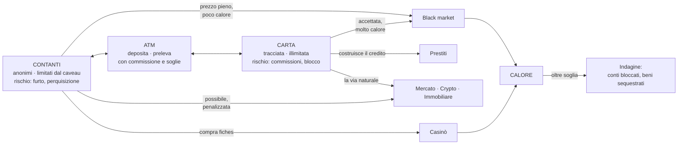

# Visione di prodotto

Cosa sarà Solvent quando sarà finito. Serve a due cose: dare un bersaglio alle decisioni di oggi,
e dire chiaramente cosa **non** si costruisce adesso.

Le meccaniche qui sotto nascono dal progetto precedente, preso come **catalogo di idee** — non di
codice e non di strutture. Ciò che era stato capito bene lì è la profondità dei domini; ciò che
era stato capito male è come collegarli.

---

## Il principio: la profondità viene dalle connessioni

Un dominio profondo non è un dominio con più pannelli. È un dominio le cui scelte **cambiano cosa
puoi fare altrove**.

| Superficiale                          | Profondo                                                                           |
| ------------------------------------- | ---------------------------------------------------------------------------------- |
| Un nodo di skill dà +5% reddito       | Un nodo di skill ti fa _vedere_ il valore stimato di un lotto prima di puntare     |
| Un evento dà +10% per 5 minuti        | Un evento chiude il black market per due ore e fa crollare l'immobiliare           |
| Il prestige dà un moltiplicatore      | Ogni era **cambia le regole**: la seconda apre il mercato nero, la terza le crypto |
| Il black market è uno shop con sconti | Il black market ha calore, reputazione e indagini: il prezzo è il rischio          |
| Il casinò è un generatore di numeri   | Le fiches sono una terza valuta con spread; il banco vince sempre un po'           |

**Regola operativa:** un dominio nuovo non entra finché non si sa dire a quali **due** altri
domini si collega e come. Un dominio che si collega solo al saldo è un minigioco, non un sistema.

---

## La spina dorsale: contanti, carta, calore

Tutto il gioco ruota attorno a una tensione sola, e ogni dominio è un modo diverso di viverla:

**Perché funziona:** i contanti sono veloci e liberi ma non scalano — il caveau ha una capacità, e
il denaro fermo non rende. La carta scala all'infinito ma lascia tracce e ti lega alle regole. Ogni
volta che il giocatore guadagna, deve decidere dove mettere quei soldi, e quella decisione ha
conseguenze a tre domini di distanza.

Senza questa tensione, dodici domini sono dodici pulsanti che fanno salire lo stesso numero.

---

## I domini

Colonna "ciclo": il loop di gioco. Colonna "profondità": cosa lo rende un sistema e non un pannello.
Colonna "si collega a": le connessioni che lo rendono ammissibile.

### Guadagnare

| Dominio                | Ciclo                                                         | Profondità                                                                                                                                      | Si collega a                                          |
| ---------------------- | ------------------------------------------------------------- | ----------------------------------------------------------------------------------------------------------------------------------------------- | ----------------------------------------------------- |
| **Impresa**            | compra attività → assumi → apri filiali → regola le politiche | politiche con trade-off reale (prezzo alto = margine ma volume basso); sinergie fra attività dello stesso settore; traguardi che sbloccano rami | skill, prestiti, immobiliare                          |
| **Immobiliare**        | compra in un distretto → migliora → affitta o rivendi         | la città ha distretti con tendenze proprie; i miglioramenti cambiano rendita **e** valore in modo diverso; lo skyline cresce a vista            | prestiti (garanzia), eventi (gentrificazione, crolli) |
| **Depositi vincolati** | blocca una somma per N tempo → riscuoti                       | liquidità contro rendimento; rompere il vincolo ha penale. È la scelta più pulita del gioco                                                     | carta, prestiti                                       |

### Rischiare

| Dominio              | Ciclo                                         | Profondità                                                                                                                                                                          | Si collega a                                            |
| -------------------- | --------------------------------------------- | ----------------------------------------------------------------------------------------------------------------------------------------------------------------------------------- | ------------------------------------------------------- |
| **Mercato (azioni)** | analizza → apri posizione → gestisci → chiudi | mercato con stato, non un numero che oscilla: fasi toro/orso/crollo, book degli ordini, posizioni con leva, grafici a candele                                                       | eventi, black market (soffiate: redditizie e rischiose) |
| **Crypto**           | come sopra, ma peggio                         | volatilità molto più alta; il mercato non dorme, quindi corre anche offline; comprabile in contanti senza lasciare tracce — **è il ponte fra contanti e investimenti**              | contanti, calore, black market                          |
| **Casinò**           | cambia contanti in fiches → gioca → ricambia  | le fiches sono una terza valuta con spread: il banco guadagna sulla conversione, sempre. Giochi con varianza diversa (dadi ≠ roulette ≠ slot); limiti di puntata legati allo status | contanti, calore (riciclare dà nell'occhio)             |
| **Black market**     | sblocca contatti → tratta → incassa           | calore, reputazione, indagini. La reputazione apre le trattative migliori; il calore sale col volume e scende col tempo; oltre soglia scatta un'indagine con conseguenze vere       | contanti, calore, skill, tutto ciò che si può rivendere |

### Ciclo degli oggetti

| Dominio         | Ciclo                                               | Profondità                                                                                                                                                               | Si collega a                                      |
| --------------- | --------------------------------------------------- | ------------------------------------------------------------------------------------------------------------------------------------------------------------------------ | ------------------------------------------------- |
| **Aste di box** | punta al buio su un lotto → apri → valuta → rivendi | il ciclo rischio/informazione più puro del gioco: vedi solo un'anteprima, e la perizia (skill) riduce l'incertezza invece di eliminarla. Profitti e perdite per sessione | skill, negozio, caveau                            |
| **Negozio**     | compra → restaura → rivendi o metti all'asta        | il valore non è fisso: condizione × rarità × domanda corrente, e la domanda oscilla. Restaurare costa tempo e soldi e non sempre conviene                                | aste, black market (roba non tracciabile), caveau |
| **Caveau**      | conserva contanti e oggetti                         | i contanti occupano spazio fisico. Capacità limitata e migliorabile: **è ciò che impedisce ai contanti di essere sempre la scelta giusta**                               | contanti, oggetti, black market                   |

### Leve e progressione

| Dominio                  | Ciclo                                    | Profondità                                                                                                                                                                                                                                                     | Si collega a               |
| ------------------------ | ---------------------------------------- | -------------------------------------------------------------------------------------------------------------------------------------------------------------------------------------------------------------------------------------------------------------- | -------------------------- |
| **Prestiti**             | chiedi → usa la leva → rimborsa          | punteggio di credito con fattori visibili che _tu_ controlli (utilizzo, storico, anzianità, mix). Il tasso è funzione del punteggio. L'insolvenza ha conseguenze vere: garanzie escusse, carta bloccata. Il debito è una **leva legittima**, non una punizione | carta, immobiliare, calore |
| **Albero delle abilità** | guadagna punti → scegli il ramo          | i nodi non danno percentuali: **sbloccano azioni** in altri domini. Rami mutuamente esclusivi che definiscono un archetipo — legale, grigio, criminale                                                                                                         | tutti                      |
| **Prestige**             | raggiungi i traguardi → ricomincia l'era | ogni era **cambia le regole**, non solo i numeri: sblocca domini, cambia le soglie di calore, cambia il materiale della carta. Perk permanenti scelti fra alternative                                                                                          | tutti                      |
| **Eventi periodici**     | accadono → duri o approfitti             | non pop-up con un bonus: cambiano le regole per un periodo. Un'ispezione fiscale rende la carta rischiosa; una retata chiude il black market; un crollo apre occasioni immobiliari                                                                             | tutti                      |

---

## Cosa questa visione impone al kernel, e che oggi non avremmo previsto

Guardare l'ampiezza vera **prima** di scrivere il kernel ha già cambiato quattro cose. È il motivo
per cui questo passaggio valeva la pena.

1. **Il Ledger ha bisogno di transazioni atomiche, non di movimenti singoli.** Un prelievo con
   commissione muove tre importi: esce dalla carta, entra nei contanti, va via la commissione. Con
   `post()` singoli, un fallimento a metà lascia il denaro in un limbo. Serve un'operazione che
   applica tutto o niente. Vedi [ADR 0019](../adr/0019-transazioni-atomiche-nel-ledger.md).

2. **Un movimento può essere rifiutato per lo strumento sbagliato, non solo per fondi.** "Questo
   contatto non accetta la carta" è un esito previsto e traducibile, non un pulsante spento senza
   spiegazione. `PostError` cresce di un caso da subito.

3. **`GameEvents` sarà la superficie di integrazione principale, non un dettaglio.** Il calore
   sale per colpa del black market, del casinò e di certi acquisti. Se ognuno importasse il
   sistema del calore, sarebbero i 74 archi diretti da capo — e il calore nel kernel sarebbe
   generalizzazione prematura, perché è un sistema di dominio come gli altri. La forma giusta è:
   ogni dominio **emette**, il sistema del calore **ascolta**. È il motivo per cui il contratto del
   Bus — sincrono, senza risposta, con guardia sulla profondità
   ([ADR 0016](../adr/0016-il-bus-e-sincrono-e-fire-and-forget.md)) — andava deciso prima dei
   domini e non dopo.

4. **Il bilanciamento va misurato, non stimato.** Tredici domini che creano e distruggono denaro
   rendono la domanda "quanto se ne crea in un'ora?" impossibile da rispondere a occhio. Da qui la
   partita doppia: [ADR 0020](../adr/0020-partita-doppia.md).

---

## Cosa NON si costruisce adesso

**Niente di quanto sta in questa pagina** entra nella prima fetta verticale. La visione serve a
scegliere bene le fondamenta, non a costruire tutto insieme — è esattamente il difetto A17, i 24
sistemi nati prima di un modo per collegarli ([ADR 0014](../adr/0014-una-fetta-verticale-alla-volta.md)).

L'ordine in cui i domini entrano, e cosa ciascuno serve a dimostrare, sta in
[roadmap-fette.md](../roadmap-fette.md).

Una sola cosa di questa pagina tocca la fetta 01: la **dualità contanti/carta**, perché è
strutturale e ritirarla dopo costerebbe una migrazione del salvataggio e una riscrittura del
Ledger. Tutto il resto aspetta.
