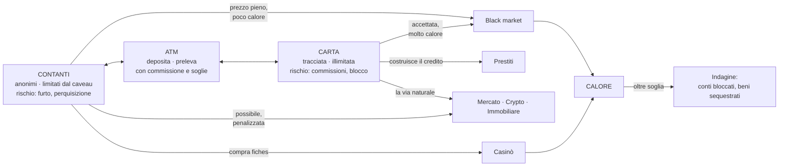

# Visione di prodotto

Cosa sarà Solvent quando sarà finito. Serve a due cose: dare un bersaglio alle decisioni di oggi,
e dire chiaramente cosa **non** si costruisce adesso.

Le meccaniche qui sotto nascono dal progetto precedente, preso come **catalogo di idee** — non di
codice e non di strutture. Ciò che era stato capito bene lì è la profondità dei domini; ciò che
era stato capito male è come collegarli.

Solvent non ha un'attività principale con dei contorni. È una **sandbox economica**: diciassette domini
che si contendono le stesse risorse, tutti disponibili a chi soddisfa i loro requisiti, in
qualunque ordine il giocatore riesca a soddisfarli.

**Nessun dominio si sblocca.** Il gioco non decide quando sei pronto: decide cosa serve, lo dice, e
il resto è affare tuo.

---

## Il principio: la profondità viene dalle connessioni

Un dominio profondo non è un dominio con più pannelli. È un dominio le cui scelte **cambiano cosa
puoi fare altrove**.

| Superficiale                          | Profondo                                                                       |
| ------------------------------------- | ------------------------------------------------------------------------------ |
| Un nodo di skill dà +5% reddito       | Un nodo di skill ti fa _vedere_ il valore stimato di un lotto prima di puntare |
| Un evento dà +10% per 5 minuti        | Un evento chiude il black market per due ore e fa crollare l'immobiliare       |
| Il black market è uno shop con sconti | Il black market ha calore, reputazione e indagini: il prezzo è il rischio      |
| Il casinò è un generatore di numeri   | Le fiches sono una terza valuta con spread; il banco vince sempre un po'       |
| L'affitto è un incasso mensile        | L'affitto è un contratto con un inquilino che può pagare tardi, o non pagare   |

**Regola operativa:** un dominio nuovo non entra finché non si sa dire a quali **due** altri
domini si collega e come. Un dominio che si collega solo al saldo è un minigioco, non un sistema.

---

## Le tre risorse scarse

Il denaro non è la risorsa scarsa di un idle: cresce sempre, per definizione. Le risorse vere sono
tre, e ogni dominio ne consuma almeno una.

| Risorsa                          | Cosa la consuma                                             | Cosa la restituisce                              | Il tetto che impone                    |
| -------------------------------- | ----------------------------------------------------------- | ------------------------------------------------ | -------------------------------------- |
| **Denaro**                       | tutto                                                       | tutto                                            | nessuno: è il punteggio, non il limite |
| **Calore** (quanto sei visibile) | black market, riciclaggio, insider trading, contanti grossi | il tempo che passa, i consulenti, la reputazione | l'indagine: conti bloccati, sequestri  |
| **Attenzione** (quanto segui)    | ogni entità gestita a mano: attività, immobili, posizioni   | delegare — e delegare costa margine ed errori    | nessuno: è un **prezzo**, non un tetto |

**Perché non basta il denaro.** Un gioco in cui l'unico limite è quanto hai finisce quando ne hai
abbastanza. Calore e attenzione sono limiti che il denaro non compra: si possono spostare, mai
eliminare. Sono loro a rendere una scelta una scelta.

L'attenzione ha una definizione precisa, e sta più sotto: non è un numero dentro il gioco, è il
tempo vero del giocatore.

---

## La spina dorsale: contanti, carta, calore

Tutto il gioco ruota attorno a una tensione sola, e ogni dominio è un modo diverso di viverla:

**Perché funziona:** i contanti sono veloci e liberi ma non scalano — il caveau ha una capacità, e
il denaro fermo non rende. La carta scala all'infinito ma lascia tracce e ti lega alle regole. Ogni
volta che il giocatore guadagna, deve decidere dove mettere quei soldi, e quella decisione ha
conseguenze a tre domini di distanza.

Senza questa tensione, diciassette domini sono diciassette pulsanti che fanno salire lo stesso numero.

---

## La casa: come diciassette domini stanno sullo stesso scaffale

Questa è la parte che va progettata **prima** dei domini, e che non riguarda nessuno di loro in
particolare.

Il problema è semplice da enunciare. Ogni dominio è un posto dove il giocatore versa denaro. Se
ognuno viene disegnato per conto suo, il giorno in cui sono diciassette la domanda «quale conviene?» ha
una risposta sola e definitiva — quello con il numero più grande — e gli altri dodici diventano
arredamento.

La casa sono le tre regole che lo impediscono. Valgono per ogni strumento, presente e futuro.

### Regola 1 — l'etichetta

Ogni strumento dichiara le stesse **otto voci**, come dati, sempre nello stesso ordine.

| #   | Voce           | Risponde a                                                   |
| --- | -------------- | ------------------------------------------------------------ |
| 1   | **Rendimento** | quanto rende. Può essere **negativo**: il casinò, i prestiti |
| 2   | **Varianza**   | quanto spesso va storto, e quanto forte                      |
| 3   | **Liquidità**  | fra quanto rivedo i soldi, e cosa costa uscire prima         |
| 4   | **Calore**     | quanto mi fa notare                                          |
| 5   | **Attenzione** | quanto devo stargli dietro                                   |
| 6   | **Pozza**      | quanto regge prima che l'attrito morda                       |
| 7   | **Pagamento**  | contanti, carta, o entrambi (ADR 0017)                       |
| 8   | **Requisito**  | cosa serve per poterlo usare                                 |

Le otto voci sono state provate riempiendole per tutti e diciassette i domini di questa pagina. Ci
stanno tutti, e nessuna voce resta vuota per più di uno.

**Un rendimento negativo non è un errore.** È così che si descrivono gli strumenti che non servono
a guadagnare: il casinò ti prende denaro e ti dà **varianza**, il prestito ti prende denaro futuro
e ti dà **liquidità adesso**, il caveau non ti dà niente e ti tiene i contanti **anonimi**. Nessuno
dei tre è un investimento, e tutti e tre stanno nell'etichetta senza forzature.

**L'etichetta descrive l'interfaccia, non l'interno.** Il casinò dentro è dadi e roulette;
l'impresa dentro è turni, fornitori e scorte. Quella profondità va progettata quando il dominio
arriva, e l'etichetta non la tocca. Serve solo a far stare diciassette cose diverse sullo stesso
scaffale — come i valori nutrizionali, che permettono di confrontare una mela e una bistecca senza
dire niente su come si cucinano.

### Regola 2 — nessuno domina

> **Nessuno strumento può essere migliore di un altro su tutte e otto le voci.**

Se lo fosse, l'altro non lo aprirebbe nessuno, e un dominio che nessuno apre è arredamento con
dentro del codice.

**Questa legge è verificabile da un test**, perché le otto voci sono dati dichiarati: si prendono
tutte le coppie di strumenti, e per ogni coppia deve esistere almeno una voce in cui il secondo
batte il primo.

È la risposta al problema di bilanciare diciassette domini fra loro. Non si tarano a mano uno contro
l'altro: si **dichiara** che nessuno domina, e un test dice il giorno in cui la dichiarazione è
diventata falsa.

### Regola 3 — come muore il secondo milione

La domanda che ogni strumento deve saper rispondere:

> **Se raddoppio quello che ci metto, raddoppio quello che ottengo?**

Se la risposta è sì per sempre, quello strumento è una macchina per soldi.

La domanda è la stessa per tutti. La risposta no, e le risposte possibili sono **quattro**.

| #   | Come muore il secondo milione | Chi risponde così                                        |
| --- | ----------------------------- | -------------------------------------------------------- |
| 1   | **Non ci sta**                | caveau, limiti di puntata, il fido, un immobile è uno    |
| 2   | **Ci sta ma non produce**     | impresa, negozio: il quartiere ha i clienti che ha       |
| 3   | **Ci sta ma lo paghi peggio** | azioni, crypto, black market: sei tu a muovere il prezzo |
| 4   | **Ci sta ma ti fa notare**    | black market, casinò, crypto comprata in contanti        |

Ogni strumento ne sceglie **almeno una**. Uno che non ne sceglie nessuna è rotto, e si vede
guardando l'etichetta.

**La forma 3 non è una punizione inventata.** Si chiama impatto di mercato ed è un problema vero: se
compri mille euro di un titolo il prezzo non se ne accorge, se ne compri cento milioni sei tu a
farlo salire mentre compri, e a farlo scendere quando esci. L'attrito non dipende da quanto sei
ricco: dipende da **quanto sei grosso rispetto a quella pozza**.

Ne discende una legge che il giocatore impara da solo:

> **Più la pozza è grande, meno rende. Più rende, più la pozza è piccola.**

Ed è il motivo per cui i gradini di scala — il locale che non potrà mai eguagliare una fabbrica —
**non vanno imposti**. Nascono da soli: il bar smette di crescere perché il quartiere ha finito i
clienti, e la cura ovvia è aprire altrove o comprare qualcosa che serve tutta la città. Un gradino
con un motivo che il giocatore capisce non è un cancello.

### La pozza infinita, e perché ce n'è una sola

Un solo strumento non satura mai: il **deposito**. Ci puoi mettere infinito, e rende sempre poco.

Serve, ed è il posto dove finisce il denaro quando tutto il resto è pieno. Ma proprio per questo:

> **Uno solo può avere la pozza infinita, e deve essere il peggiore di tutti.**

Se due strumenti hanno pozza infinita, quello che rende di più vince per sempre.

---

## Il tempo: un giorno dura due secondi

È il **cambio** che rende confrontabili «3% all'anno» e «12 € al secondo». Senza, le percentuali di
questa pagina non vogliono dire niente.

| Unità     | Dura    |
| --------- | ------- |
| Giorno    | 2 s     |
| Settimana | 14 s    |
| Mese      | ~1 min  |
| Anno      | ~12 min |

**Perché così corto.** La durata del giorno ha due padroni che tirano in direzioni opposte: le
percentuali annue vogliono un anno **corto**, le scadenze vogliono un giorno **lungo**. Vince il
primo, e non per gusto — per aritmetica.

Con un anno di gioco da un'ora, prima che le azioni all'8% battano lo stipendio iniziale servono
547.000 € investiti, cioè **dodici ore e mezza** di gioco. Con un anno da sei ore, settantasei. A
quelle scale il dominio più curato del gioco resta chiuso per sempre, e la tabella dei rendimenti
diventa una nota nel manuale.

Con un anno da dodici minuti, invece, tutte le percentuali di questa pagina restano **vere** e
diventano **giocabili**:

- le azioni all'8% pareggiano lo stipendio a **110.000 €** investiti, cioè ~2,5 h di gioco;
- un immobile al 4% netto si ripaga in venticinque anni, cioè **~5 h**;
- un deposito al 3% raddoppia in ventiquattro anni, cioè **~5 h**.

**Niente calendario.** In cento ore di gioco passano cinquecento anni, e una data vera direbbe
«anno 2526». Al suo posto un **contatore di giorni** — «giorno 4.512» — e le scadenze dette sempre
come durate: «il contratto scade fra 8 mesi». È anche ciò che serve davvero ad affitti, rate, aste
e anzianità di credito, che vogliono sapere quanto manca e non che giorno è.

Il numero vive in `balance/` ([ADR 0023](../adr/0023-il-tempo-di-gioco-e-un-sistema-di-dominio.md))
e va **misurato** con un bersaglio in `targets.ts`, come tutti gli altri.

---

## L'attenzione: un prezzo, non un cancello

L'attenzione fa lo stesso mestiere che in un altro gioco farebbero le fasi di progressione:
impedire di avere tutto insieme. Ma lo fa **senza cancellare niente**.

| Come lo gestisci | Cosa rende              | Cosa ti costa                           |
| ---------------- | ----------------------- | --------------------------------------- |
| **A mano**       | 100%                    | i tuoi secondi veri                     |
| **Delegato**     | ~80%                    | una percentuale, e ogni tanto un errore |
| **Abbandonato**  | quello che rendeva ieri | il mondo si muove senza di te           |

**L'attenzione non è un numero dentro il gioco: è il tempo vero del giocatore.** Non puoi seguire
quaranta cose a mano — non perché il gioco te lo vieti, ma perché non ci stai fisicamente. Quindi
deleghi, e delegare costa margine.

Ne nasce la scelta di strategia più larga del gioco:

> **Poche cose curate al 100%, o tante cose delegate all'80%?**

Non c'è una risposta giusta: dipende da quanto tempo vero vuoi metterci. Un giocatore che segue tre
attività a mano può battere uno che ne ha dieci delegate, e viceversa quando le dieci diventano
trenta.

---

## A finestra chiusa il mondo va avanti

La domanda non è «quanto guadagno mentre sono via». È **cosa succede al mio patrimonio mentre non
guardo**.

> **Il mondo va avanti sempre. Si fermano solo le tue decisioni.**

Il mercato si muove che tu guardi o no. L'affitto arriva se l'inquilino paga. Gli interessi
maturano, compresi quelli che devi tu. Le cose delegate lavorano. Quello che non succede è
**scegliere**: nessuno chiude una posizione al momento giusto, nessuno rilancia all'asta, nessuno
rifornisce il negozio.

Ne discende che chiudere la finestra è una decisione vera, ogni volta:

| Chiudi con tutto in… | Torni dopo otto ore con                             |
| -------------------- | --------------------------------------------------- |
| Crypto               | +40%, oppure −60%                                   |
| Azioni con leva      | tanto, o niente: la margin call scatta mentre dormi |
| Immobili affittati   | l'affitto incassato, se l'inquilino ha pagato       |
| Deposito             | poco, ma sicuro                                     |
| Contanti nel caveau  | quanto ci sta nel caveau, e non un centesimo di più |

**Vincolo che ne discende, e non è negoziabile:** gli strumenti per proteggersi — lo stop-loss, il
vincolo, la posizione senza leva — devono esistere **nello stesso momento** in cui esiste la cosa
rischiosa. Altrimenti perdere non è una conseguenza: è una fregatura.

Il recupero **simula davvero** i tick mancati, con lo stesso codice del tempo reale
([ADR 0009](../adr/0009-passo-fisso-e-tipi-branded-per-il-tempo.md)). Non esiste una formula
offline separata da bilanciare a parte, che è la fonte classica di exploit negli idle.

### La legge del tetto di recupero

> **Il progresso offline non deve mai battere il gioco attivo.**

Non è una preferenza: senza, la strategia ottima è chiudere la finestra, e un gioco la cui mossa
migliore è non giocarlo è rotto.

Il tetto di recupero è ciò che la fa rispettare, e ne discende che **non si misura in ore reali**.
Con un giorno da due secondi, otto ore di assenza valgono **trentanove anni di gioco**: a un
rendimento annuo dell'ottavo percento fanno un portafoglio per venti, mentre un'ora di gioco attivo
ne vale cinque e lo moltiplica per uno e mezzo. Dormire renderebbe tredici volte più che giocare.

Il tetto va quindi dichiarato in **tempo di gioco** — quanti giorni al massimo il mondo può
avanzare mentre non ci sei — e scelto perché quel numero, giocato attivamente, costa più tempo di
quello che è costato dormirci sopra. Il numero è di competenza della fetta che lo affronta; la
legge no.

### Il recupero deve vedere le soglie

Un recupero che esegue **un solo** passo lungo non è la stessa cosa di molti passi corti, e la
differenza non è la precisione: è che **le soglie attraversate e rientrate diventano invisibili**.

Una margin call che sarebbe scattata alla seconda ora e si sarebbe risanata alla sesta non scatta.
Il calore che sfonda e ridiscende non chiama nessuna indagine. Un'attività che va sotto il fido e
risale non fallisce.

Ne discende che «il mondo va avanti **anche contro di te**» è vero solo se il recupero avanza a
**blocchi** abbastanza corti da vedere una soglia. Non è una formula offline separata — è lo stesso
codice eseguito più volte, che è il contrario di ciò che l'ADR 0009 vieta.

---

## Come si apre il gioco: requisiti, non fasi

Nessun dominio si sblocca. Ognuno dichiara un **requisito**, e il giocatore lo soddisfa quando ci
riesce, nell'ordine che si costruisce da sé.

### La regola che rende vero il sandbox

> **I requisiti devono essere di tipi diversi. Non tutti soldi.**

Se ogni requisito fosse «avere X euro», l'unica progressione sarebbe diventare ricchi e l'ordine di
apertura dei domini sarebbe **identico per tutti**: una progressione lineare con un altro nome.

Quattro tipi, e ogni dominio ne usa almeno uno che non è capitale:

| Tipo                                 | Esempio                                     |
| ------------------------------------ | ------------------------------------------- |
| **Uno strumento**                    | le azioni vogliono un conto titoli          |
| **Una relazione**                    | il black market vuole un contatto           |
| **Un punteggio costruito nel tempo** | i prestiti vogliono uno storico sulla carta |
| **Una cosa che possiedi**            | l'impresa vuole una sede, cioè un immobile  |

Il capitale può essere un requisito. Non può essere **l'unico**.

### Cosa ne discende, in concreto

- Il **casinò** è aperto dal primo minuto: entri con i contanti in tasca.
- I **prestiti** no, e nessuna somma li apre: serve uno storico sulla carta, e lo storico vuole
  tempo.
- Il **black market** vuole un contatto, e i contatti si incontrano — al casinò, alle aste,
  comprando roba che non è pulita.
- L'**impresa** vuole una sede, quindi passa dall'immobiliare.

Due giocatori aprono i domini in ordini diversi. Uno va al casinò la prima sera, ci perde, incontra
un tipo e finisce nel black market. Un altro non ci mette mai piede, tiene la carta pulita per sei
mesi di gioco e apre i prestiti che il primo non avrà mai.

Nessuno dei due è stato guidato, ed entrambi ci sono arrivati con le proprie forze.

### Un requisito deve essere visibile e muovibile

Un requisito che il giocatore non può vedere, o che non sa come soddisfare, è una progressione
nascosta — cioè la stessa cosa da cui questa sezione esiste per scappare.

Ne discende che un requisito sta sempre in uno **stato che il giocatore vede e su cui può agire**.
Mai un contatore interno.

### Quanto si vede al minuto zero

**Il pulito si vede, il grigio si scopre.**

Banche, broker, depositi, immobiliare, prestiti: elencati dal primo secondo, ognuno con scritto
cosa gli manca — «serve un conto titoli: 500 €». Si può pianificare tutto ciò che è legale.

Il black market, certi contatti, certe occasioni non compaiono finché non li incontri facendo
qualcosa. È realistico — le banche fanno pubblicità, i criminali no — e la scoperta è guidata dalle
**tue azioni**, non dal tuo patrimonio.

Quando una cosa compare, è subito usabile se hai il requisito. Comparire non è sbloccarsi.

### Cosa resta delle quattro ere

Le quattro ere — contanti, capitale, impresa, rete — erano l'impalcatura di una pressione che
calore e attenzione producono già da sole. L'impalcatura si toglie, la pressione resta.

Restano come **lettura interna**: «cosa farà per primo la maggior parte dei giocatori», utile a noi
per decidere cosa costruire prima. Il giocatore non le vede, non le nomina, e non ne raggiunge mai
una. Vivono in [roadmap-fette.md](../roadmap-fette.md), non qui.

---

## Come si cresce

Due meccanismi diversi, e confonderli è l'errore che rende un'economia o esplosiva o immobile.

**I miglioramenti fanno la scala.** Un miglioramento ha due numeri: quanto costa e quanto rende. Se
il costo cresce come la resa, ogni livello si ripaga **nello stesso tempo del precedente**, per
sempre. Un bar che al livello 0 costa 1.000 € e rende 10 €/s si ripaga in cento secondi; al livello
20 costa 3,3 M€ e rende 33.250 €/s, e si ripaga ancora in cento secondi. Stessa sensazione, tremila
volte i numeri.

Se la resa crescesse più del costo il gioco esploderebbe; se crescesse meno si impianterebbe. È
l'unico rapporto che conta, e va misurato con un bersaglio.

**Le percentuali confrontano.** La tabella dei rendimenti più sotto non è il motore della crescita:
è il **listino**. Serve a rispondere a «ho un euro in mano, dove lo metto adesso, e cosa pago in
cambio». Devono essere vere **l'una rispetto all'altra**; non devono essere vere in assoluto.

**I gradini nascono dalle pozze.** Non si dichiara che un locale si ferma al livello dieci: si
dichiara quanto è grande la pozza del quartiere, e il locale si ferma da solo quando l'ha
riempita.

---

## La scala: fin dove arriva il gioco

Il bersaglio dichiarato è **~1e30 €**. Non è una sensazione: è il numero da cui discendono due
scelte tecniche, e serve a poterle scegliere invece di subirle.

| Tetto       | Dove                      | Cosa succede oltre                           |
| ----------- | ------------------------- | -------------------------------------------- |
| **~9e15 €** | conversione a `number` JS | lo schermo comincia a mentire                |
| **1e18 €**  | `Decimal` a 20 cifre      | `1e18 + 0,01 = 1e18`: i centesimi spariscono |

Il secondo è il grave: **la somma di tutti i conti smette di fare zero**, cioè INV-08 si rompe in
silenzio, e nessun test se ne accorgerebbe perché nessun test usa numeri così. Quel 20 è il valore
predefinito di decimal.js, non una scelta del progetto — ed è la ragione per cui va scelto.

Ne discendono due cose, entrambe dichiarate qui e costruite quando serviranno:

- **La precisione di `Decimal` si sceglie deliberatamente**, con margine largo sopra il bersaglio.
  A 40 cifre i centesimi reggono fino a 1e38.
- **Il denaro si formatta partendo dal `Decimal`**, mai da un `number`. È un difetto che aspetta,
  non un'opzione: il tetto dello schermo è più basso di quello del libro mastro.

---

## Niente prestige

Il prestige fa tre lavori, e in questo gioco due non servono: azzerare numeri ingestibili — c'è
spazio fino a 1e30 — e dare un moltiplicatore permanente, che è la cosa che questa pagina rifiuta
da sempre. Il terzo, cambiare le regole per rigiocare, si ottiene meglio altrove.

E c'è un problema di coerenza: un prestige che «apre certi domini da subito» rimetterebbe in piedi
i cancelli che i requisiti tolgono, dalla parte del premio.

**Al suo posto, due cose che esistono già.**

- **Perdere tutto è già nel gioco.** L'indagine sequestra, l'insolvenza escute le garanzie, la
  margin call chiude la posizione mentre dormi. Il reset non è un pulsante che premi per un bonus:
  è quello che ti succede se strafai.
- **Il mondo è seedato** ([ADR 0005](../adr/0005-rng-seedato-con-stream-per-dominio.md)). Una
  partita nuova ha distretti diversi, contatti diversi, fasi di mercato diverse. Rigiocabilità
  senza nessuna valuta meta.

### I traguardi

Senza prestige e senza una fine, serve qualcosa che dia forma alla corsa. I **traguardi** sono
obiettivi visibili che **non sbloccano niente**: dicono cosa hai fatto, e suggeriscono cosa si
può fare.

- «un immobile in ogni distretto»
- «chiudi un anno di gioco con un miliardo»
- «sopravvivi a un'indagine senza vendere niente»
- «arriva a 1e12 senza toccare niente di grigio»

Sono compatibili con la sandbox proprio perché non aprono porte. Una porta che si apre per un
traguardo è un cancello con un nome gentile.

---

## La mappa dei domini

Colonna "ciclo": il loop di gioco. Colonna "requisito": cosa serve per usarlo — e almeno uno per
dominio non è denaro. Colonna "si collega a": le connessioni che lo rendono ammissibile.

I requisiti qui sono **illustrativi**: dicono di che _tipo_ sono, non il valore esatto. Quello si
decide quando il dominio si costruisce.

| Dominio                  | Ciclo                                                         | Requisito                          | Si collega a                                      |
| ------------------------ | ------------------------------------------------------------- | ---------------------------------- | ------------------------------------------------- |
| **Reddito**              | il tempo passa → i soldi entrano                              | nessuno                            | contanti, carta, skill                            |
| **Bancomat**             | deposita → preleva, con commissione e soglie                  | una carta                          | contanti, carta                                   |
| **Caveau**               | conserva contanti e oggetti                                   | nessuno                            | contanti, oggetti, black market                   |
| **Casinò**               | cambia contanti in fiches → gioca → ricambia                  | contanti in tasca                  | contanti, calore                                  |
| **Calore**               | accumula visibilità → aspetta o ripulisci                     | —                                  | tutti i domini grigi                              |
| **Aste di box**          | punta al buio su un lotto → apri → valuta → rivendi           | un budget e un posto dove metterla | skill, negozio, caveau                            |
| **Negozio**              | compra → restaura → rivendi o metti all'asta                  | una sede                           | aste, black market, caveau                        |
| **Black market**         | sblocca contatti → tratta → incassa                           | **un contatto**                    | contanti, calore, skill, tutto ciò che si rivende |
| **Depositi vincolati**   | blocca una somma per N tempo → riscuoti                       | una carta                          | carta, prestiti                                   |
| **Mercato (azioni)**     | analizza → apri posizione → gestisci → chiudi                 | **un conto titoli**                | eventi, black market (soffiate), prestiti (leva)  |
| **Crypto**               | come il mercato, ma peggio                                    | un portafoglio                     | contanti, calore, black market                    |
| **Prestiti**             | chiedi → usa la leva → rimborsa                               | **uno storico sulla carta**        | carta, immobiliare, calore                        |
| **Immobiliare**          | compra in un distretto → migliora → affitta o rivendi         | capitale                           | prestiti (garanzia), impresa (sedi), eventi       |
| **Impresa**              | compra attività → assumi → apri filiali → regola le politiche | **una sede**                       | skill, prestiti, immobiliare                      |
| **Albero delle abilità** | guadagna punti → scegli il ramo                               | punti, che si guadagnano giocando  | tutti                                             |
| **Eventi periodici**     | accadono → duri o approfitti                                  | —                                  | tutti                                             |
| **Indagini**             | il calore sfonda → subisci → ti difendi                       | — (arriva da sé)                   | tutti i domini grigi                              |

---

## La profondità, dominio per dominio

Qui "profondo" smette di essere un aggettivo. Ogni sezione dice cosa deve esistere perché il
dominio sia un sistema e non un pannello.

### Impresa — più attività, ognuna con il suo budget

Il giocatore possiede da una a molte attività. Ognuna è un'entità con vita propria:

- **Un budget suo.** Non un numero del dominio: un conto vero nel libro mastro
  ([ADR 0022](../adr/0022-il-ledger-ha-conti-non-solo-pool.md)). Ci si versa e si preleva, e il
  bilancio dell'attività — cassa, ricavi, costi, margine — si **legge** dal Ledger invece di
  essere ricostruito.
- **Una sede.** Affittata o di proprietà: è il collegamento diretto con l'immobiliare. Il
  distretto della sede decide il passaggio, quindi la domanda — cioè **la pozza**.
- **Persone.** Assumere è un costo fisso che non cala quando cala il fatturato: è ciò che rende
  un'attività capace di fallire.
- **Politiche con trade-off reale.** Prezzo alto = margine alto e volume basso. Qualità alta =
  reputazione che cresce lentamente e costi che crescono subito. Orari lunghi = più ricavi e più
  turnover del personale. Nessuna politica è dominante: ognuna sposta due numeri in direzioni
  opposte.
- **Uno stato che cambia da solo.** Domanda locale, scorte, reputazione, usura. Un'attività
  lasciata sola non resta ferma: peggiora.
- **Il fallimento.** Budget sotto zero oltre il fido = insolvenza. L'attività chiude, i debiti
  restano, e il punteggio di credito ne risente.
- **Sinergie e filiali.** Due attività dello stesso settore condividono fornitori; una catena
  costa meno della somma delle sue parti — ma consuma più attenzione.

**L'impresa satura per la forma 2:** oltre un certo capitale il quartiere non ha altri clienti da
darti, e il denaro in più semplicemente non produce. La cura è un'altra sede, o una pozza più
grande. E il suo costo vero non è nemmeno la pozza: è l'attenzione, perché regolare venti attività
a mano non si può, e delegarle costa margine.

### Immobiliare e affitti — un contratto, non un incasso

Il canone non è un numero che entra ogni mese. È un **contratto con una controparte**.

- **La città ha distretti**, ognuno con tendenze proprie: prezzo, domanda di affitti, degrado. Un
  distretto può gentrificarsi o affondare, e non per caso: gli eventi lo muovono. Un distretto è
  anche una pozza: gli immobili sono quelli che sono.
- **L'immobile** ha tipo, condizione, valore di mercato e canone potenziale. Le **migliorie**
  cambiano rendita e valore in modo **diverso**: rifare il bagno alza il canone, rifare la facciata
  alza il valore. Sceglierne una è scegliere fra rendita e plusvalenza.
- **L'inquilino** ha un contratto con durata, canone, deposito cauzionale, e un'affidabilità che
  non si vede tutta prima di firmare. Paga puntuale, paga tardi, smette di pagare.
- **Lo sfratto** costa tempo e denaro, e nel frattempo il canone non entra.
- **Lo sfitto** esiste: fra un contratto e l'altro l'immobile costa e non rende. È la ragione per
  cui la rendita lorda e quella netta sono due numeri diversi, ed è la lezione del dominio.
- **La manutenzione** non è opzionale. I guasti accadono; se non ripari, la condizione cala, il
  canone cala, e alla scadenza l'inquilino non rinnova.
- **Le tasse e il mutuo.** Un immobile comprato a leva rende molto o distrugge, secondo se il
  canone copre la rata. È il collegamento con i prestiti, ed è la prima volta che la leva ha un
  senso positivo.

### Aste e garage wars — comprare informazione

Il ciclo rischio/informazione più puro del gioco.

- **Il lotto si vede a metà.** Un'anteprima, non un inventario. La **perizia** (skill) restringe
  l'intervallo di valore stimato: lo riduce, non lo azzera.
- **Gli altri offerenti sono avversari**, non rumore: hanno budget, stile e pazienza diversi. Uno
  rilancia sempre di poco, uno sparisce sopra una soglia, uno ti fa salire di proposito.
- **Le garage wars sono una sessione**: più lotti, **un budget totale**. Vincere il primo lotto
  significa non poter puntare sul terzo. È lì che sta il gioco, ed è una pozza di forma 1.
- **Dopo l'aggiudicazione** il lotto si apre e diventa oggetti: condizione, rarità, tracciabilità.
  Vanno al negozio, al restauro, al black market se non sono puliti — o allo smaltimento, che
  **costa**. I costi nascosti sono ciò che rende un'asta vinta male peggio di un'asta persa.

### Casinò — scambiare varianza, non guadagnare

Al casinò non si investe: il rendimento atteso è negativo e dichiarato. Ci si va perché è l'unico
posto dove mille euro possono diventarne cinquantamila in un minuto.

- **Le fiches sono una terza valuta con spread.** Il banco guadagna sulla conversione, in entrata e
  in uscita, anche quando vinci. Chi entra ed esce spesso perde per attrito, senza mai perdere una
  mano.
- **Giochi con varianza diversa e ritorno dichiarato**, come dato di bilanciamento: slot (varianza
  altissima, ritorno basso), roulette (via di mezzo), dadi e blackjack (varianza bassa se giochi
  bene). Il giocatore può **calcolare** l'aspettativa, e resta negativa: è il punto.
- **I limiti di puntata dipendono dallo status.** Il tavolo alto si apre giocando, non pagando. Sono
  la pozza del casinò, di forma 1: dieci milioni su un tavolo non ce li metti, devi fare mille mani
  e ogni mano paga il banco.
- **Cambiare troppi contanti in fiches alza il calore** — forma 4. Il casinò è anche una lavanderia,
  ed è la lavanderia più cara e più vistosa del gioco.
- **Nessun trucco del banco.** L'Rng è seedato e verificabile
  ([ADR 0005](../adr/0005-rng-seedato-con-stream-per-dominio.md)): non esiste codice che ti faccia
  perdere perché stavi vincendo. La sfiducia è il modo più veloce di uccidere un dominio d'azzardo.

### Mercato e crypto — un mercato con stato

Non un numero che oscilla attorno a una media.

- **Il mercato ha fasi**: toro, orso, laterale, crollo. Ognuna ha tendenza e volatilità proprie, e
  la transizione fra fasi non è annunciata.
- **I titoli hanno un settore**, e i settori sono correlati: una notizia sull'energia muove
  quattro titoli insieme. Diversificare significa qualcosa solo se le correlazioni esistono.
- **Ordini veri**: a mercato, con limite, stop-loss. Un ordine con limite che non si eseguirà mai
  è un errore del giocatore, e il gioco glielo lascia fare. Lo **stop-loss è anche la protezione
  che rende onesto il progresso offline**, e per questo nasce insieme alla leva, non dopo.
- **Posizioni lunghe e corte, con leva.** La leva porta la **margin call**: se il margine non
  regge, la posizione si chiude da sola, in perdita, mentre non guardi. È il modo più veloce di
  perdere tutto nel gioco, ed è per questo che esiste.
- **La profondità del libro è la pozza** — forma 3. Un titolo grande la assorbe, uno piccolo no:
  comprare troppo muove il prezzo contro di te, all'entrata e all'uscita.
- **Candele OHLC** in liste limitate ([ADR 0010](../adr/0010-liste-storiche-limitate-alla-definizione.md)),
  perché un grafico che non si può leggere non è un mercato.
- **Dividendi** per le azioni: un rendimento lento che premia chi non guarda.
- **La crypto è lo stesso motore con altri numeri**: volatilità tre o quattro volte più alta,
  tendenza che può essere zero, commissioni di rete, e una pozza molto più sottile. Due differenze
  strutturali: **non dorme**, quindi corre anche a gioco chiuso, e **si compra in contanti** — è
  l'unico ponte fra i contanti e il capitale che non passa dall'ATM, e per questo alza il calore.
- **Le soffiate del black market** sono informazione: redditizia, e insider. Usarla è calore.

### Gli altri domini, in breve

- **Prestiti.** Punteggio di credito con fattori **visibili e controllabili** — utilizzo, storico,
  anzianità, mix. Il tasso è funzione del punteggio. L'insolvenza escute le garanzie e blocca la
  carta. Il debito è una leva legittima, non una punizione. Il fido è la sua pozza, di forma 1.
- **Depositi vincolati.** La scelta più pulita del gioco: liquidità contro rendimento, con penale
  se rompi il vincolo prima. È **l'unico strumento con pozza infinita**, ed è per questo che rende
  meno di tutti.
- **Negozio e restauro.** Il valore non è fisso: condizione × rarità × domanda corrente, e la
  domanda oscilla — cioè satura. Restaurare costa tempo e denaro e non sempre conviene.
- **Caveau.** I contanti occupano spazio fisico. La capienza è ciò che impedisce ai contanti di
  essere sempre la scelta giusta, e si amplia ma non all'infinito.
- **Calore e indagini.** Sale col volume e col metodo, scende col tempo. Oltre soglia scatta
  un'indagine: conti congelati, beni sequestrati, un periodo in cui metà del gioco è chiuso.
- **Albero delle abilità.** I nodi non danno percentuali: **sbloccano azioni**. Rami mutuamente
  esclusivi che definiscono un archetipo — legale, grigio, criminale.
- **Eventi periodici.** Non pop-up con un bonus: cambiano le regole per un periodo. Un'ispezione
  fiscale rende la carta rischiosa; una retata chiude il black market; un crollo apre occasioni
  immobiliari.

---

## Come si tiene bilanciato

Sei leggi. Un dominio che ne viola una è rotto, e va corretto invece che compensato con un numero.

1. **Nessun rendimento senza uno svantaggio.** Ogni fonte di guadagno paga in almeno una di quattro
   monete: **liquidità** (i soldi sono bloccati), **tracciabilità** (lasci impronte), **varianza**
   (a volte perdi), **attenzione** (devi seguirlo). Un dominio che non ne paga nessuna è una
   macchina per soldi.
2. **Il rendimento atteso cresce meno del rischio.** Raddoppiare il guadagno atteso costa più del
   doppio in varianza, in calore o in attenzione. È ciò che impedisce a "sempre la scelta più
   aggressiva" di essere la strategia ottima.
3. **Ogni strumento dichiara come muore il secondo milione.** Una delle quattro forme, almeno. Uno
   strumento che assorbe capitale all'infinito senza perdere efficienza è la fine del gioco, perché
   diventa l'unica risposta a ogni domanda.
4. **Nessuno strumento domina un altro su tutte le voci dell'etichetta.** Un dominio dominato è
   codice che nessuno aprirà mai. È l'unica legge che un test può verificare da solo, e per questo
   è quella che va scritta come dati.
5. **Il banco vince sempre un po'.** Ogni conversione costa: commissione dell'ATM, spread delle
   fiches, commissione di rete della crypto, diritti d'asta, provvigione dell'agenzia. È ciò che
   impedisce ai cicli di conversione di diventare guadagno puro, ed è il motivo per cui i conti
   `fees` e `house` esistono nel libro mastro ([ADR 0020](../adr/0020-partita-doppia.md)).
6. **Il reddito attivo ha un tetto; il capitale no.** Lo stipendio e i suoi upgrade arrivano a un
   plateau. Da lì in poi si cresce solo mettendo il capitale a lavorare. Senza questa legge il gioco
   diventa un moltiplicatore che si insegue da solo, e ogni dominio patrimoniale resta per sempre
   peggiore del pulsante iniziale.

### Cosa vuol dire "realistico"

**I rapporti fra i domini sono quelli veri; i valori assoluti sono scala di gioco.** Un rendimento
immobiliare del 5% annuo è realistico; che una casa costi 200.000 € quando il giocatore ne guadagna
40.000 all'ora non lo è, e non deve esserlo: a scalare sono i prezzi, non le percentuali.

L'ordine dei rendimenti attesi, e cosa si paga per ognuno. **È un listino per scegliere, non un
motore di crescita**: la crescita viene dai miglioramenti e dalle pozze più grandi.

| Dominio                | Rendimento atteso (annuo, ordine di grandezza reale) | Cosa paghi in cambio                      |
| ---------------------- | ---------------------------------------------------- | ----------------------------------------- |
| **Deposito vincolato** | 2 – 4 %                                              | liquidità                                 |
| **Immobiliare, netto** | 3 – 5 % (lordo 5 – 8, meno sfitto, guasti e tasse)   | liquidità e attenzione                    |
| **Mercato azionario**  | 7 – 10 %, con volatilità 15 – 25 %                   | varianza                                  |
| **Impresa**            | 10 – 20 % sul capitale investito                     | molta attenzione                          |
| **Crypto**             | 0 – 15 %, oppure −80 %, con volatilità 60 – 100 %    | varianza estrema                          |
| **Black market**       | +30 – 80 % per operazione                            | calore                                    |
| **Aste**               | +0 – 30 % atteso, varianza altissima                 | informazione imperfetta, attenzione       |
| **Casinò**             | **−2 – −8 % per giro**                               | è il prezzo della varianza e del lavaggio |

Il **prestito** sta dall'altra parte: costa 5 – 20 % annuo secondo il punteggio. Prendere a
prestito all'8% per investire al 5% perde, e il gioco lascia farlo. La leva ha senso solo dove il
rendimento supera il tasso, o dove serve a prendere un'occasione che domani non c'è più.

**Cosa rende giocabili percentuali vere:** la velocità del tempo di gioco, che è decisa più sopra —
un giorno dura due secondi, un anno dodici minuti. È il cambio senza il quale questa tabella non
vuol dire niente, ed è per questo che è **il numero di bilanciamento più importante del progetto**.

---

## Cosa questa visione impone al kernel, e che oggi non avremmo previsto

Guardare l'ampiezza vera **prima** di scrivere il kernel ha già cambiato dieci cose. È il motivo
per cui questo passaggio valeva la pena, ed è stato fatto quattro volte: le prime quattro voci
nascono dalla prima lettura, la quinta e la sesta dall'aver messo per iscritto la profondità dei
domini, la settima e l'ottava dall'aver progettato la casa, le ultime due dall'aver riletto il
codice **dopo** aver riscritto questa pagina — che è la volta in cui è venuto fuori il difetto più
grosso, e la prova che le altre tre non bastavano.

1. **Il Ledger ha bisogno di transazioni atomiche, non di movimenti singoli.** Un prelievo con
   commissione muove tre importi: esce dalla carta, entra nei contanti, va via la commissione. Con
   `post()` singoli, un fallimento a metà lascia il denaro in un limbo. Serve un'operazione che
   applica tutto o niente. Vedi [ADR 0019](../adr/0019-transazioni-atomiche-nel-ledger.md).

2. **Un movimento può essere rifiutato per lo strumento sbagliato, non solo per fondi.** "Questo
   contatto non accetta la carta" è un esito previsto e traducibile, non un pulsante spento senza
   spiegazione. `LedgerError` cresce di un caso da subito.

3. **`GameEvents` sarà la superficie di integrazione principale, non un dettaglio.** Il calore
   sale per colpa del black market, del casinò e di certi acquisti. Se ognuno importasse il
   sistema del calore, sarebbero i 74 archi diretti da capo — e il calore nel kernel sarebbe
   generalizzazione prematura, perché è un sistema di dominio come gli altri. La forma giusta è:
   ogni dominio **emette**, il sistema del calore **ascolta**. È il motivo per cui il contratto del
   Bus — sincrono, senza risposta, con guardia sulla profondità
   ([ADR 0016](../adr/0016-il-bus-e-sincrono-e-fire-and-forget.md)) — andava deciso prima dei
   domini e non dopo.

4. **Il bilanciamento va misurato, non stimato.** Tredici domini che creano e distruggono denaro
   rendono la domanda "quanto se ne crea in un'ora?" impossibile da rispondere a occhio. Da qui la
   partita doppia: [ADR 0020](../adr/0020-partita-doppia.md).

5. **I conti del libro mastro non possono essere sei e fissi.** Le attività, gli immobili e le
   posizioni sono entità che il **giocatore crea giocando**, e ognuna ha denaro suo. O quel denaro
   sta nel Ledger — e allora i conti si aprono e si chiudono — o sta in cinque domini che
   reinventano i saldi, che è il difetto A05 con un nome nuovo.
   Vedi [ADR 0022](../adr/0022-il-ledger-ha-conti-non-solo-pool.md).

6. **Serve un solo posto che sa che giorno è.** Affitti, rate, scadenze d'asta, depositi che
   maturano, anzianità di credito: metà della profondità di questa pagina è fatta di **durate**. Un
   sistema riceve quanti tick sono passati, non a che punto siamo; se ogni dominio si tiene un
   contatore, la prima volta che due non sono d'accordo il difetto è distribuito e non si trova.
   La soluzione non tocca il kernel — è un dominio che emette — ma andava vista prima di scrivere
   i domini. Vedi [ADR 0023](../adr/0023-il-tempo-di-gioco-e-un-sistema-di-dominio.md).

7. **Le capienze non possono essere costanti compilate.** La pozza di uno strumento si sposta:
   il caveau si amplia, un distretto si sviluppa, il fido cresce col punteggio. Una capienza si
   **chiede**, non si legge. Vedi
   [ADR 0025](../adr/0025-la-capienza-di-un-pool-si-chiede-non-si-legge.md).

8. **La precisione del denaro è una decisione, non un default.** Con un bersaglio a 1e30 e la
   partita doppia come invariante più profondo del progetto, le venti cifre predefinite di
   decimal.js sono un tetto a 1e18 oltre il quale la somma dei conti smette di fare zero **in
   silenzio**. Va scelta, e va scelta prima che esista un salvataggio in mano a qualcuno.
   Vedi [ADR 0026](../adr/0026-la-precisione-del-denaro-e-dichiarata.md).

9. **Il recupero avanza a blocchi, e il suo tetto si misura in tempo di gioco.** Le due leggi della
   sezione _A finestra chiusa_ non toccano il contratto del tick — `tickAll(ctx, elapsed)` resta
   quello che è — ma toccano **chi lo chiama**: oggi il recupero esegue un passo solo con tutti i
   tick arretrati, e con un mondo che può andare contro il giocatore quel passo solo nasconde ogni
   soglia. È il difetto che la preparazione di [D017](../delega/D017-il-caveau.md) ha trovato nella
   sua forma mite, e la visione lo promuove a strutturale.

10. **L'etichetta non può essere un campo del `System`.** Il bancomat non ha un sistema — non ha
    stato e non ticchetta ([D014](../delega/D014-dominio-bancomat.md)) — eppure ha un'etichetta,
    perché è uno strumento che il giocatore confronta con gli altri. Ne discende che la lista degli
    strumenti e la lista dei sistemi sono **due liste diverse**, e che la seconda non può contenere
    la prima. Serve il meccanismo che impedisce a un dominio di nascere senza etichetta, sul modello
    di `tests/rules/registry-completeness`: senza, la legge della non dominanza verifica solo i
    domini che qualcuno si è ricordato di dichiarare.

---

## Cosa NON si costruisce adesso

**Niente di quanto sta in questa pagina** entra prima della fetta che lo nomina. La visione serve a
scegliere bene le fondamenta, non a costruire tutto insieme — è esattamente il difetto A17, i 24
sistemi nati prima di un modo per collegarli ([ADR 0014](../adr/0014-una-fetta-verticale-alla-volta.md)).

**La casa è un modulo da riempire, non codice da scrivere adesso.** L'etichetta a otto voci, la
legge della non dominanza e le quattro forme di saturazione descrivono cosa ogni dominio futuro
dovrà dichiarare. Diventano un tipo e un test **quando esistono due o tre strumenti veri da cui
generalizzare**, non prima: una struttura disegnata su un dominio solo è una struttura disegnata
male, ed è lo stesso motivo per cui i conti dinamici e il calendario aspettano il loro grilletto.

L'ordine in cui i domini entrano, e cosa ciascuno serve a dimostrare, sta in
[roadmap-fette.md](../roadmap-fette.md), insieme al registro di ciò che è deciso e non costruito.
